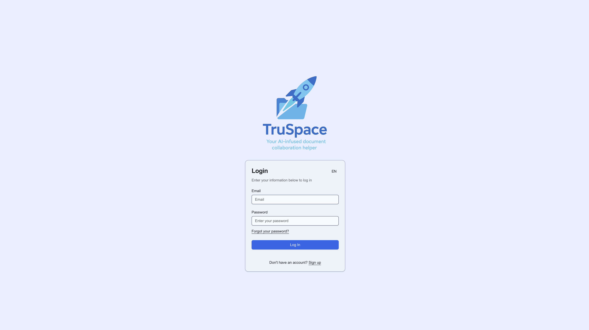
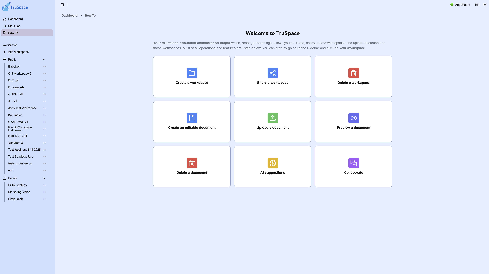
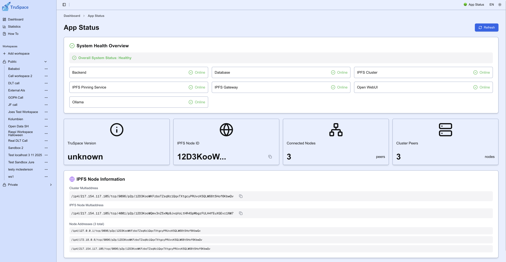
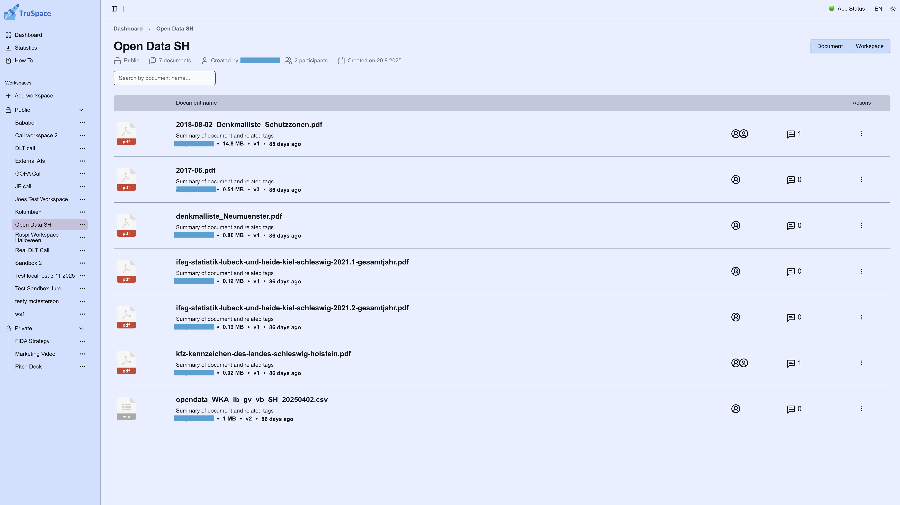
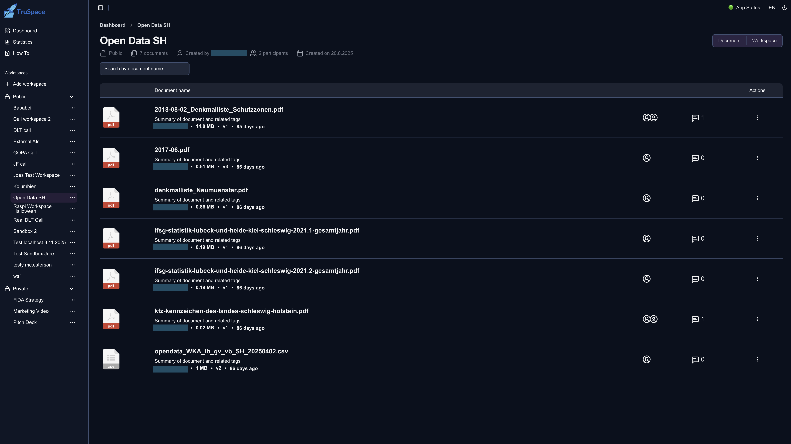
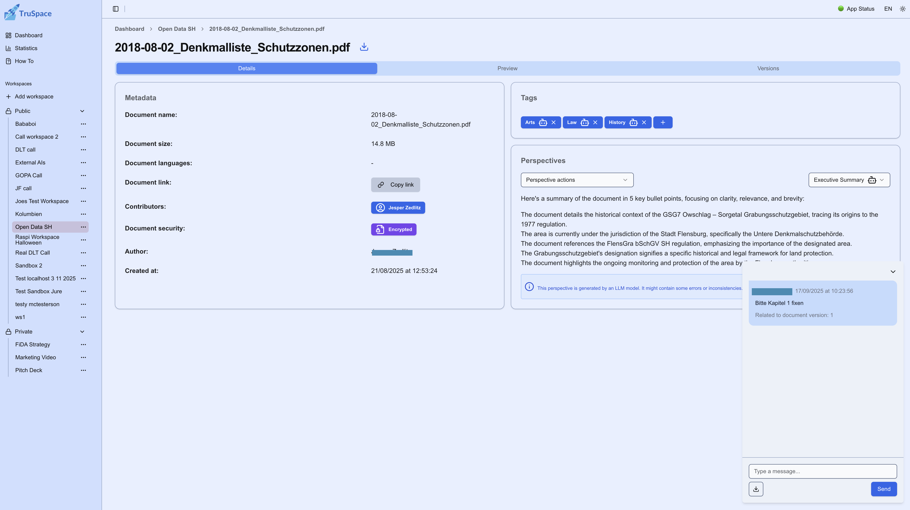

<div align="center">
    
</div>

# TruSpace - an AI-infused, decentralized and sovereign document workspace

<p align="center" style="display: flex; flex-direction: column; gap: 10px;">

  <!-- Row 1 -->
  <div style="display: flex; justify-content: center; gap: 10px;">
    
    
    
  </div>

  <!-- Row 2 -->
  <div style="display: flex; justify-content: center; gap: 10px; margin-top: 10px;">
    
    
    
  </div>

</p>

The purpose of TruSpace is to make collaboration on documents between several stakeholders more efficient while making the respective data **sovereign to all** participants. It uses AI to support document interpretation and decentralization to stay in control of your data.

[](https://ipfs.tech) [](https://ipfscluster.io) [](https://www.docker.com/) [](https://www.typescriptlang.org/) [](https://reactjs.org) [](https://nextjs.org) [](https://ollama.com) [](https://openwebui.com) [](./LICENSE)

## ✨ Key Features

- 🆓 100% open-source, sovereign and self-hostable - no cloud provider needed
- 🔄 Fully decentralized storage using IPFS: Automatic sync of data between trusted IPFS nodes/partners (private or public setup)
- 🧠 Local AI interpretation of documents using Ollama + Open Web UI using customisable pre-defined prompts
- 🗂️ Workspace-based organization of content and participants

## Quick start, I want to..

- 🧪 [Play around in a sandbox demo environment](#play-around-in-an-online-sandbox-demo-environment)
- 💻 [Install TruSpace locally](#install-truspace-locally)
- 🌐 [Connect to other TruSpace nodes](#connect-to-other-truspace-nodes)
- 📚 [Check out architecture, guides, details](#check-out-architecture-guides-details)

## Play around in an online sandbox demo environment

To check how TruSpace works, get to the sandbox installation at https://truspace.dev, register a new user, login and start playing with private and public workspaces! It's an experiment-sandbox, so your data might get deleted occasionally.

## Install TruSpace locally

For a very **quick and easy** TruSpace setup on your local machine using `localhost`, run:

```bash
git clone git@github.com:openkfw/TruSpace.git
cd TruSpace
./start.sh
```

<video src="https://github.com/user-attachments/assets/d75b27a5-3556-466f-80fc-d3fdea68917c" title="TruSpace Installation Demo"></video>

### What should I expect?

<details>
<summary>Please open to see the expected results with screenshots</summary>

1. Open frontend in your browser at [http://localhost:3000](http://localhost:3000) to see the login screen:
   

2. Click on "Register" to create a new user account. Fill out the required fields. The user account is local, your data is not going anywhere.
   

3. After the submission, the app takes you back to the login screen, and from there to the dashboard.
   

If something doesn't work, check that all containers are running with `docker ps`. They should show these containers:
| CONTAINER ID | IMAGE | COMMAND | CREATED | STATUS | PORTS | NAMES |
|--------------|--------------------------------------|--------------------------|------------------|--------------------------|--------------------------------------------------------------------------------------------------|---------------------|
| 14f... | ghcr.io/open-webui/open-webui:main | "bash start.sh" | 26 minutes ago | Up 26 minutes (healthy) | 0.0.0.0:3333->8080/tcp | truspace-webui-1 |
| 412... | ipfs/ipfs-cluster:latest | "/usr/bin/tini -- /u…" | 26 minutes ago | Up 26 minutes | 0.0.0.0:9094->9094/tcp, 0.0.0.0:9096-9097->9096-9097/tcp, 9095/tcp | cluster0 |
| 7b4...| truspace-backend | "sh ./entrypoint.sh" | 26 minutes ago | Up 26 minutes | 0.0.0.0:8000->8000/tcp | truspace-backend-1 |
| 783... |truspace-frontend | "sh startup.sh" | 26 minutes ago | Up 26 minutes (healthy) | 0.0.0.0:3000->3000/tcp, :::3000->3000/tcp | truspace-frontend-1|
| 590... | ipfs/kubo:release | "/sbin/tini -- /usr/…" | 26 minutes ago | Up 26 minutes (healthy) | 0.0.0.0:4001->4001/tcp, 0.0.0.0:5001->5001/tcp, 4001/udp, 0.0.0.0:8080->8080/tcp, 8081/tcp | ipfs0 |

</details>

<br>

> [!NOTE]
> For more details on the local installation, feel free to check out one of the insallation guides [here](./doc/Admin%20Guide/Setup%20TruSpace/Installation.md). There are guides for a local dev setup, standalone server and raspberry pi.

### FAQ - Local Installation

<details>
<summary>Can I configure how I start the application?</summary>

You have multiple options to configure the TruSpace installation before starting it. You can either edit the `.env` file directly (after copying it from `.env.example`). You can find a detailed description of all environment variables in [ENVIRONMENT_VARIABLES.md](./doc/ENVIRONMENT_VARIABLES.md).

Alternatively, you can set flags in `start.sh` to enable certain behaviors:

- `--dev` : starts the application in development mode (always build backend and frontend instead of pulling docker images (identical to `BUILD_OR_PULL_IMAGES=build`))
- `--local-frontend`: start the frontend locally instead of in Docker
- `--no-ai`: disable AI functionality (Ollama and Open-WebUI) when starting the application (identical to `DISABLE_ALL_AI_FUNCTIONALITY=true`)
- `--remove-peers`: after IPFS starts, remove default bootstrap peers via the IPFS API

</details>

<details>
<summary>What happens beneath the hood?</summary>

The `start.sh` script creates a simple `.env` configuration, docker volumes and spins up `docker compose` containing backend api and IPFS and additionally NextJS frontend in dev mode. After startup, the frontend is available on `http://localhost:3000`. Register a user, login and create a workspace for documents!

To enable AI analysis, TruSpace downloads a model configured in `.env`, as an example here is `gemma3:1b` and you can see the full list at the [ollama DB](https://ollama.com/library?q=mistral&sort=popular).

Once the model is downloaded, AI analysis is executed upon each document upload automatically.

</details>

<details>
<summary>How do I customize the domain?</summary>

If you plan on using another domain (e.g. on a local raspberry), make sure that the respective domains are updated from `localhost` to your `domain.local` in the `CORS` fields of the `.env` file (`CORS_ORIGIN` and `OI_CORS_ALLOW_ORIGIN`). This can be easily done in the `TruSpace` folder using the example environment:

```bash
sed 's|http://localhost|http://example.com|g' .env.example > .env
```

You can also use the `scripts/configure-env.sh` to configure your domains and some other settings interactively:

```bash
./scripts/configure-env.sh
```

</details>

## Connect to other TruSpace nodes

You have a TruSpace node running and would like to connect to another (private) network to sync the TruSpace data? It's simple - but you need to exchange some configuration values in order to have a secure private connection.

We have created an **automated** way to connect your TruSpace IPFS node to another TruSpace IPFS node using 2 scripts:

- `scripts/fetch-connection.sh`: This script fetches the necessary connection details from the target node ([find the script here](../../../scripts/fetch-connection.sh))
- `scripts/connectPeer-automatic.sh`: This script connects your local TruSpace IPFS node to the target node using the fetched details ([find the script here](../../../scripts/connectPeer-automatic.sh))

In an ideal environment, these commands are all you need to connect to another TruSpace node:

```bash
# On you target node, run and create encrypted connection details:
# Flag -e or --encrypted creates encrypted files for secure transfer
./scripts/fetch-connection.sh -e

# On your local node, store the received .connection and .connection.password files in the root TruSpace directory, then run:
./scripts/connectPeer-automatic.sh .connection .connection.password
```

<video src="https://github.com/user-attachments/assets/3d670619-b047-4d63-a736-f2ac94a7d0ad" title="TruSpace Connection Demo"></video>

For more **manual** control, we also provide a manual setup option further with `scripts/connectPeer-manually.sh`

```bash
./scripts/connectPeer-manually.sh <peer_ip> <ipfs_peer_id> <cluster_peer_id> <ipfs_container_id> <cluster_container_id> [swarm_key_path] [cluster_secret_path]
```

> [!NOTE]
> For more details on the how the connection to other IPFS nodes works, please read the detailed guide [here](./doc/Admin%20Guide/Setup%20TruSpace/Connecting%20to%20other%20nodes.md).

## Check out architecture, guides, details...

### 🧑‍💻 User Guide

An extensive user guide with screenshots is available in the folder [User Guide](./doc/User%20Guide/). You can also check out our demo video on [YouTube](https://www.youtube.com/watch?v=dpo_D3NJpqE)!

### ⚗️ Developer Guide

For a guide on how to set up a development environment, contribute code, report issues and submit pull requests, please refer to the [Developer Guide](./doc/Developer%20Guide/README.md).

### 🛠️ Admin Guide

An extensive admin guide with screenshots is available in the folder [Admin Guide](./doc/Admin%20Guide/)

### ⚙️ Environment Variables

This project uses a set of environment variables to configure its frontend, backend, IPFS, and AI components.

For a complete reference and description of all variables, see [ENVIRONMENT_VARIABLES.md](./doc/ENVIRONMENT_VARIABLES.md)

### 🧰 Tech Stack and Architecture overview

| Layer                 | Technologies                                                                                                                                                                                                                                                                                                                                                                                                                                                                                                                |
| --------------------- | --------------------------------------------------------------------------------------------------------------------------------------------------------------------------------------------------------------------------------------------------------------------------------------------------------------------------------------------------------------------------------------------------------------------------------------------------------------------------------------------------------------------------- |
| Frontend              | [](https://www.typescriptlang.org/) [](https://reactjs.org) [](https://nextjs.org) [](https://www.radix-ui.com/) |
| Backend               | [](https://www.typescriptlang.org/) [](https://expressjs.com)                                                                                                                                                                                                                                   |
| Decentralized storage | [](https://ipfs.tech) [](https://ipfscluster.io)                                                                                                                                                                                                                                                                                      |
| User Database         | [](https://sqlite.org)                                                                                                                                                                                                                                                                                                                                                                                                 |
| LLM Engine            | [](https://ollama.com)                                                                                                                                                                                                                                                                                                                                                                                                                             |
| AI API and RAG        | [](https://openwebui.com)                                                                                                                                                                                                                                                                                                                                                                                                            |
| Containerization      | [](https://www.docker.com/)                                                                                                                                                                                                                                                                                                                                                                                            |

In the overview, you can see how the components work together. The UI and API is part of this repository and provides the interface and the translation to other services. Once you start TruSpace, it pulls and connects to containers from Open Web UI (for AI processing) and IPFS/IPFS-Cluster to persist the data. The respective ports are outlined in the image.


### Data model for workspaces in IPFS

The data model has a hierarchical structure of workspaces, documents and metadata. They are linked using UUIDs in the metadata-fields of the IPFS files. Each data entry is a single (small) file to avoid merge conflicts in the IPFS network, e.g. in case of network split. The concept is outlined in the visual representation of the [Data model](./doc/datamodel.png "Data model")

The specific fields are described in [backend/src/types/interfaces/truspace.ts](backend/src/types/interfaces/truspace.ts)

### IPFS Sync for the decentralization of data

- Ideally, each organization runs its own node
- Nodes automatically replicate documents and metadata (e.g. chats, versions, AI perspectives) within the network
- Pinning is orchestrated via IPFS Cluster to ensure data availability
- Fault-tolerant and censorship-resistant architecture

### Security & Data Privacy

- Sensitive data (e.g. login credentials) is stored encrypted in **SQLite** on the local node
- Documents are synced only to **trusted IPFS peers**, IPFS can be configured as private network by default
- All inter-node communications are encrypted
- Documents are encrypted with workspace ID

## 🤝 Contribution Guide

We welcome contributions! Please read the [CONTRIBUTING.md](CONTRIBUTING.md) and the [Developer Guide](./doc/Developer%20Guide/README.md) for:

- Setting up a development environment
- Reporting issues and submitting pull requests
- Code style guidelines

## 📜 License

This project is licensed under the **GNU General Public License v3.0**. See the [LICENSE](./LICENSE) file for details.

## 💬 Community & Support

- User guide: [User Guide](./doc/User%20Guide/README.md)
- Developer guide: [Developer Guide](./doc/Developer%20Guide/README.md)
- Admin guide: [Admin Guide](./doc/Admin%20Guide/README.md)
- Discussions: [GitHub Discussions](https://github.com/openkfw/TruSpace/discussions)
- Report issues: [GitHub Issues](https://github.com/openkfw/TruSpace/issues)
- Intro Story to get what it's about: [Medium Blog](https://medium.com/@angryarchitect/your-place-or-my-place-a-tale-of-decentralization-and-sovereignty-c775dafbadbb)
