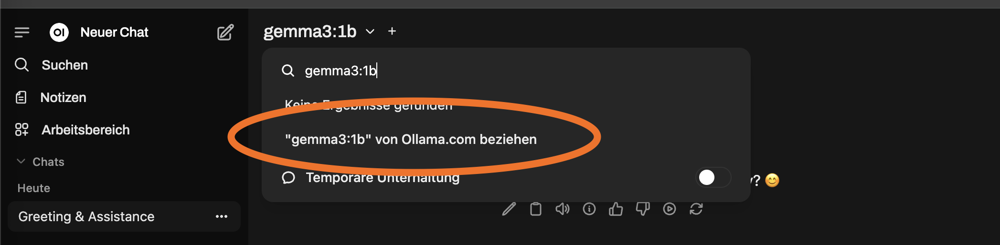
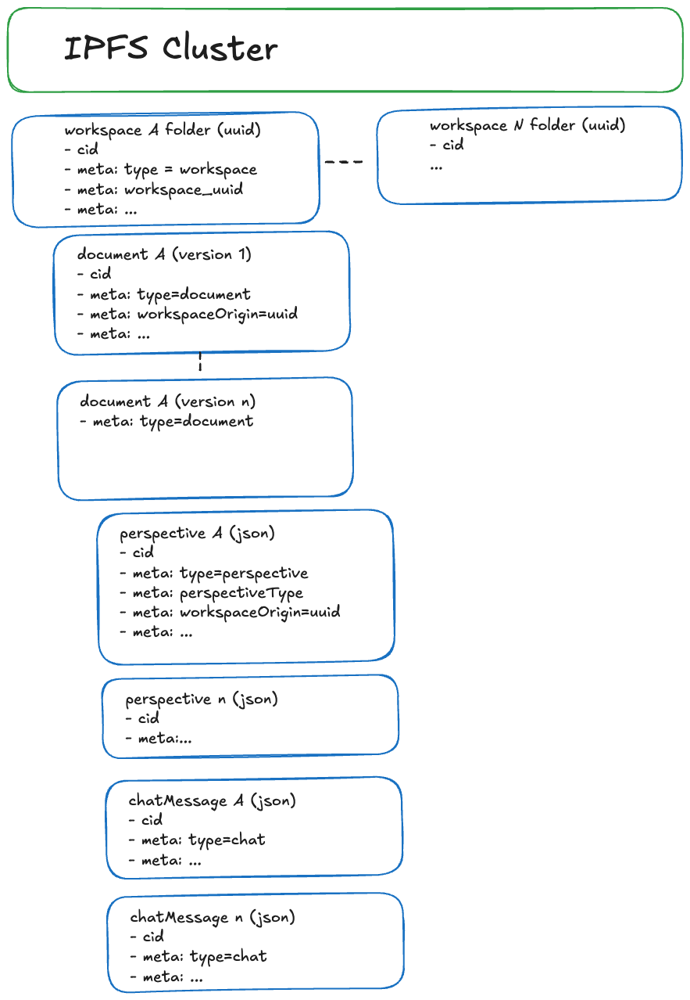

# 🌐 TruSpace - an ai-infused, decentralized and sovereign document workspace

The purpose of TruSpace is to make collaboration on documents between several stakeholders more efficient while making the respective data sovereign to all participants. It uses AI to support document interpretation and decentralization to stay in control of your data.

**Collaborative, decentralized document sharing and editing platform** built with **Next.js**, **Express.js**, **SQLite**, and **IPFS Cluster**. Enhanced with local LLM capabilities via **Ollama**, **Open Web UI** and a nice web-interface.

---

## 📌 Table of Contents

1. [Introduction](#-introduction)
2. [Key Features](#-key-features)
3. [Start TruSpace in production](#-start-truSpace-in-production)
   - [Prerequisites](#-prerequisites)
   - [Environment Variables](#-environment-variables)
   - [Quick start](#-quick-start)
4. [Getting local environment started](#-getting-local-environment-started)
   - [Prerequisites](#-prerequisites)
   - [Environment Variables](#-environment-variables)
   - [Quick start](#-quick-start)
5. [Usage](#-usage)
   - [Creating Workspaces](#-creating-workspaces)
   - [Uploading and Editing Documents](#-uploading-and-editing-documents)
   - [LLM Summarization](#-llm-summarization)
   - [IPFS Sync](#-ipfs-sync)
6. [Architecture Overview](#-architecture-overview)
7. [Tech Stack](#-tech-stack)
8. [Security & Data Privacy](#-security--data-privacy)
9. [Decentralization with IPFS Cluster](#-decentralization-with-ipfs-cluster)
10. [Contribution Guide](#-contribution-guide)
11. [Roadmap](#-roadmap)
12. [License](#-license)
13. [Community & Support](#-community--support)

---

## 🧭 Introduction

**TruSpace** is an open-source platform designed to enable **sovereign**, **decentralized**, and **intelligent** document collaboration between individuals and organizations.

---

## ✨ Key Features

- 🆓 100% open-source, sovereign and self-hostable - no cloud provider needed
- 🔄 Automatic sync of data between trusted IPFS cluster nodes/partners (private or public setup)
- 🧠 Local AI interpretation of documents using Ollama + Open Web UI using customisable pre-defined prompts
- 🗂️ Workspace-based organization of content and participants
- 📄 Rich-text collaborative editing (WYSIWYG)
- 🌍 Fully decentralized storage using IPFS Cluster
- 🔐 Local storage of sensitive data in SQLite

---

## 🚀 Start TruSpace in production

### 🔧 Prerequisites

- Docker
- File storage for docker volumes

### 📥 Quick start

If you want to run in production mode, e.g. on your virtual machine, start:

```bash
git clone https://github.com/openkfw/TruSpace.git
cd production
bash start-prod.sh
```

> ⚠️ **Warning:**  
> If you encounter an error such as  
> `Error response from daemon: error while creating mount source path '/.../truspace/production/volumes/cluster0': chown /.../truspace/production/volumes/cluster0: permission denied`  
> you may need to set the correct permissions for the `/production/volumes` folders using `chown` or `chmod` commands, depending on your system setup.
> You can use commands like `sudo chown -R 1000:1000 ./volumes` or `sudo chmod -R 744 ./volumes` and restart the application with `bash start-prod.sh`

This script is meant for production run. If you want to start application for local development or testing follow [Dev Installation](./DEV_INSTALLATION.md) manual.

## 🖥️ Getting local environment started

### 🔧 Prerequisites

- Node.js (>= 22)
- Docker (for IPFS cluster and Ollama models)
- File storage for docker volumes

For installation guide, please see [Installation and running of local environment](./DEV_INSTALLATION.md)

### 📥 Quick start

For a very **quick and easy** TruSpace setup (e.g. for demos and first look), run:

```bash
git clone git@github.com:openkfw/TruSpace.git
# Start development server
sh start.sh
```

it spins up docker compose containing backend api and IPFS clusters and additionally NextJS frontend in dev mode. After startup, the frontend is available on `http://localhost:3000`. Register a user and start using it!

To enable AI analysis, you need to download the LLM model of your choice, as an example here is `gemma3:1b` and you can see the full list at the [ollama DB](https://ollama.com/library?q=mistral&sort=popular).

- Login to the Open Web UI on `http://localhost:3333`. For login, use the values from the `.env` file, by default `admin@admin.com/admin`. Type the model you specified in the `.env` file in the search bar and Open Web UI offers you to download it.

  

Add commentMore actions

**You made it!**

If something doesn't work, check that all containers are running with `docker ps`. They should show these containers:
| CONTAINER ID | IMAGE | COMMAND | CREATED | STATUS | PORTS | NAMES |
|--------------|--------------------------------------|--------------------------|------------------|--------------------------|--------------------------------------------------------------------------------------------------|---------------------|
| 14f... | ghcr.io/open-webui/open-webui:main | "bash start.sh" | 26 minutes ago | Up 26 minutes (healthy) | 0.0.0.0:3333->8080/tcp | truspace-webui-1 |
| 412... | ipfs/ipfs-cluster:latest | "/usr/bin/tini -- /u…" | 26 minutes ago | Up 26 minutes | 0.0.0.0:9094->9094/tcp, 0.0.0.0:9096-9097->9096-9097/tcp, 9095/tcp | cluster0 |
| 7b4...| truspace-backend | "sh ./entrypoint.sh" | 26 minutes ago | Up 26 minutes | 0.0.0.0:8000->8000/tcp | truspace-backend-1 |
| 783... |truspace-frontend | "sh startup.sh" | 26 minutes ago | Up 26 minutes (healthy) | 0.0.0.0:3000->3000/tcp, :::3000->3000/tcp | truspace-frontend-1|
| 590... | ipfs/kubo:release | "/sbin/tini -- /usr/…" | 26 minutes ago | Up 26 minutes (healthy) | 0.0.0.0:4001->4001/tcp, 0.0.0.0:5001->5001/tcp, 4001/udp, 0.0.0.0:8080->8080/tcp, 8081/tcp | ipfs0 |

### ⚙️ Environment Variables

Create a `.env` file in the root directory for development or in `scripts/production` for production usage. Use `.env.example` as a template:

```bash
cp .env.example .env
```

This project uses a set of environment variables to configure its frontend, backend, IPFS, and AI components.

For a complete reference and description of all variables, see  
➡️ [ENVIRONMENT_VARIABLES.md](./ENVIRONMENT_VARIABLES.md)

---

## 🧑‍💻 Usage

### 🔧 Create workspaces

- Navigate to the app
- Click **Add Workspace** in left menu
- Assign a name to a workspace
- Share workspace with contributors and partners using the share button

### 📤 Upload and collaborate on documents

- Upload PDFs, Word documents or upload any other type of documents to share with other collaborators. AI views are calculated on upload of word or PDF files.
- Edit documents directly in browser with a collaborative WYSIWYG editor
- Upload additional versions if needed
- In the chat screen, document interactions on the document, e.g. approvals or acknowledgements

### 🤖 Generate LLM AI perspectives

- Document summaries are triggered automatically (for .pdf and .docx documents)
- View multiple perspectives (e.g. management, legal, digitalisation)
- Add your own user perspectives from configured prompts. Details in [LLM Prompts](./doc/prompts.md)

### 🔄 IPFS Sync

- All documents are stored on IPFS
- TruSpace nodes form a decentralized mesh
- Changes are synced automatically using the pinning strategy by IPFS Cluster

---

## Tech Architectural overview


---

## 🧰 Tech Stack

| Layer          | Technology                                                          |
| -------------- | ------------------------------------------------------------------- |
| Frontend       | [Next.js](), [Radix UI](https://www.radix-ui.com/)                  |
| Backend        | [Express.js](https://expressjs.com/)                                |
| Database       | [SQLite](https://sqlite.org/)                                       |
| Decentralized  | [IPFS](https://ipfs.tech/), [IPFS Cluster](https://ipfscluster.io/) |
| LLM Engine     | [Ollama](https://ollama.com/)                                       |
| AI API and RAG | [Open Web UI](https://openwebui.com/)                               |

---

## 🔐 Security & Data Privacy

- Sensitive data (e.g. login credentials) is stored encrypted in **SQLite** on the local node
- Documents are synced only to **trusted IPFS peers**, IPFS can be configured as private network by default
- All inter-node communications are encrypted
- Documents are encrypted with workspace ID

---

## 🌐 Decentralization with IPFS Cluster

- Each organization runs its own node
- Nodes automatically replicate documents and metadata (e.g. chats, versions, AI perspectives) within the network
- Fault-tolerant and censorship-resistant

---

## 🤝 Contribution Guide

We welcome contributions! Please read the [CONTRIBUTING.md](CONTRIBUTING.md) for:

- Setting up a development environment
- Reporting issues and submitting pull requests
- Code style guidelines

---

## 🛣 Roadmap

- [ ] Real-time collaboration with CRDTs
- [ ] Role-based access controls
- [ ] Federated identity system
- [ ] Mobile-friendly UI
- [ ] Plugin system for document types and AI models

---

## 📜 License

This project is licensed under the **GNU General Public License v3.0**. See the [LICENSE](./LICENSE) file for details.

---

## 💬 Community & Support

- Discussions: [GitHub Discussions](https://github.com/openkfw/TruSpace/discussions)
- Report issues: [GitHub Issues](https://github.com/openkfw/TruSpace/issues)

---

## Data model for workspaces in IPFS

The data model has a hierarchical structure of workspaces, documents and metadata. They are linked using UUIDs in the metadata-fields of the IPFS files. Each data entry is a single (small) file to avoid merge conflicts in the IPFS network, e.g. in case of network split. The concept is outlined below:



The specific fields are described in [backend/src/types/interfaces/truspace.ts](backend/src/types/interfaces/truspace.ts)
