<div align="center">
    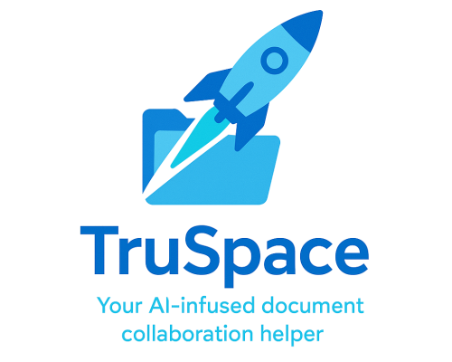
</div>

# TruSpace - an AI-infused, decentralized and sovereign document workspace

<p align="center" style="display: flex; flex-direction: column; gap: 10px;">

  <!-- Row 1 -->
  <div style="display: flex; justify-content: center; gap: 10px;">
    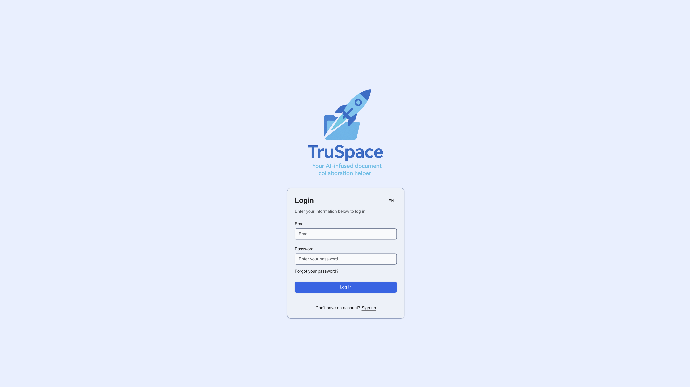
    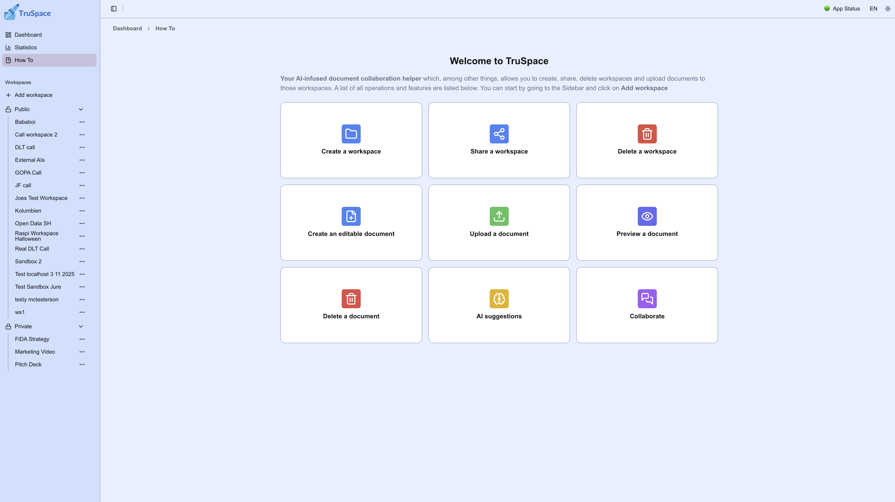
    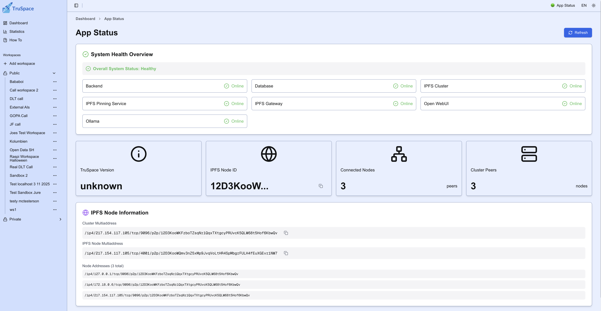
  </div>

  <!-- Row 2 -->
  <div style="display: flex; justify-content: center; gap: 10px; margin-top: 10px;">
    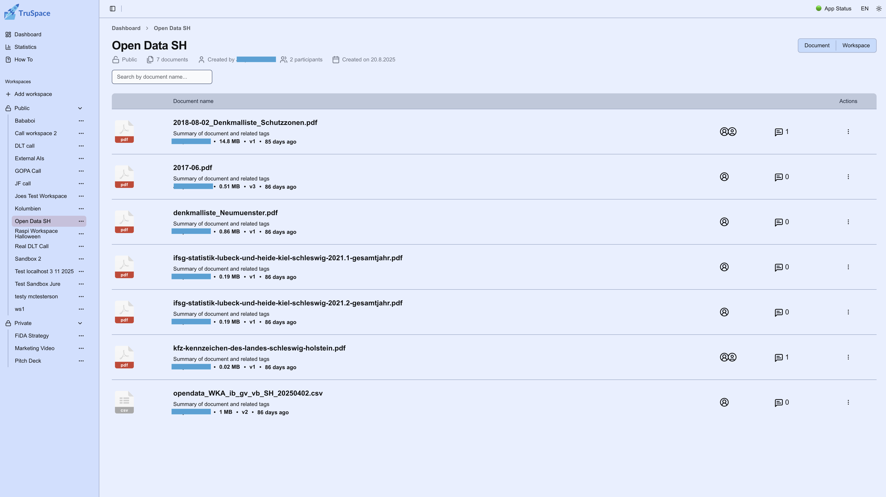
    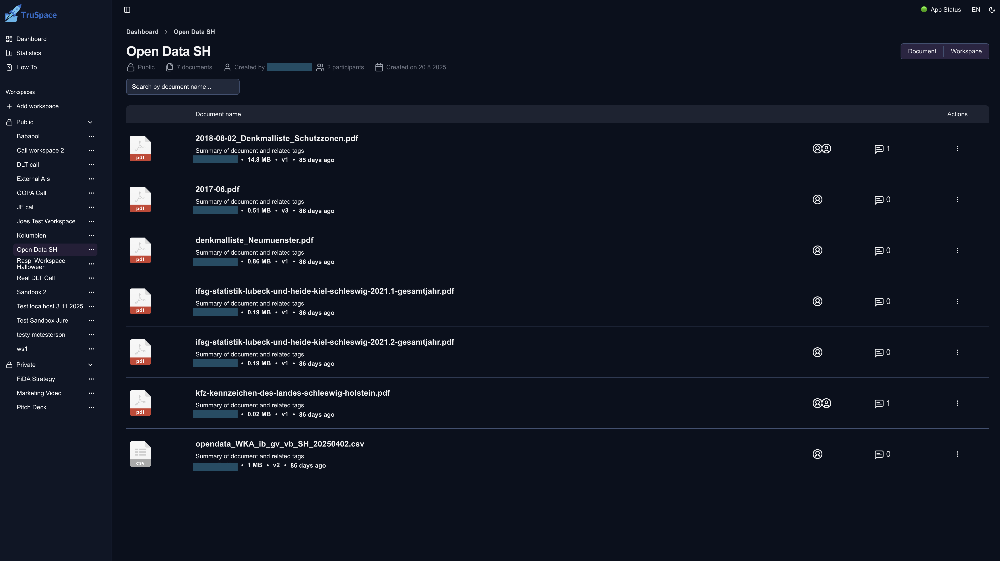
    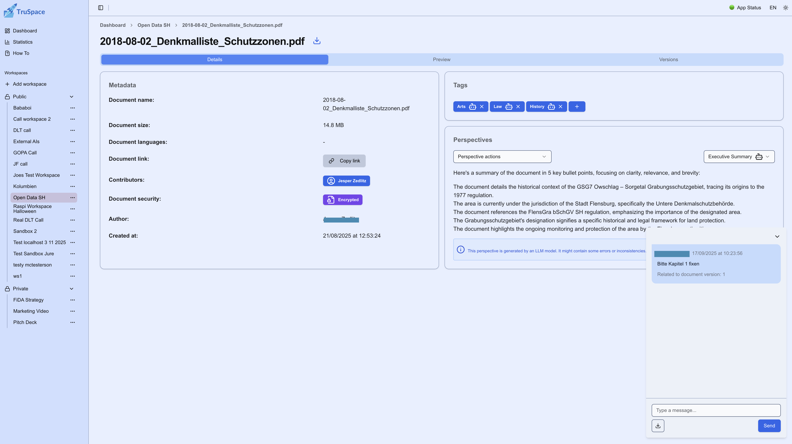
  </div>

</p>

The purpose of TruSpace is to make collaboration on documents between several stakeholders more efficient while making the respective data **sovereign to all** participants. It uses AI to support document interpretation and decentralization to stay in control of your data.

[](https://ipfs.tech) [](https://ipfscluster.io) [](https://www.docker.com/) [](https://www.typescriptlang.org/) [](https://reactjs.org) [](https://nextjs.org) [](https://ollama.com) [](https://openwebui.com) [](./LICENSE)

## ✨ Key Features

- 🆓 100% open-source, sovereign and self-hostable - no cloud provider needed
- 🔄 Fully decentralized storage using IPFS: Automatic sync of data between trusted IPFS nodes/partners (private or public setup)
- 🧠 Local AI interpretation of documents using Ollama + Open Web UI using customisable pre-defined prompts
- 🗂️ Workspace-based organization of content and participants

## Quick start, I want to..

- 🧪 [Play around in a sandbox demo environment](#play-around-in-an-online-sandbox-demo-environment)
- 💻 [Install TruSpace locally](https://web.truspace.dev/site/getting-started/installation/local/)
- 🌐 [Connect to other TruSpace nodes](https://web.truspace.dev/site/getting-started/installation/local/)
- 📚 [Check out architecture, guides, details](https://web.truspace.dev/site/architecture/)

## Play around in an online sandbox demo environment

To check how TruSpace works, get to the sandbox installation at https://truspace.dev, register a new user, login and start playing with private and public workspaces! It's an experiment-sandbox, so your data might get deleted occasionally.

## Install TruSpace locally

For a very **quick and easy** TruSpace setup on your local machine using `localhost`, run:

```bash
git clone git@github.com:openkfw/TruSpace.git
cd TruSpace
./start.sh
```

<video src="https://github.com/user-attachments/assets/d75b27a5-3556-466f-80fc-d3fdea68917c" title="TruSpace Installation Demo"></video>

### What should I expect?

<details>
<summary>Please open to see the expected results with screenshots</summary>

1. Open frontend in your browser at [http://localhost:3000](http://localhost:3000) to see the login screen:
   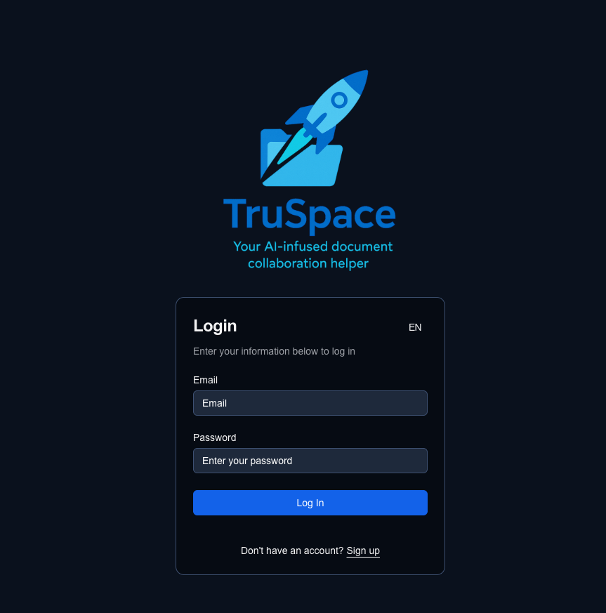

2. Click on "Register" to create a new user account. Fill out the required fields. The user account is local, your data is not going anywhere.
   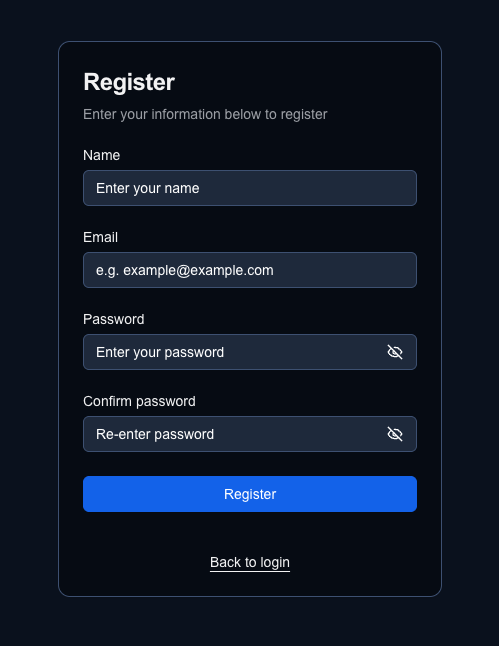

3. After the submission, the app takes you back to the login screen, and from there to the dashboard.
   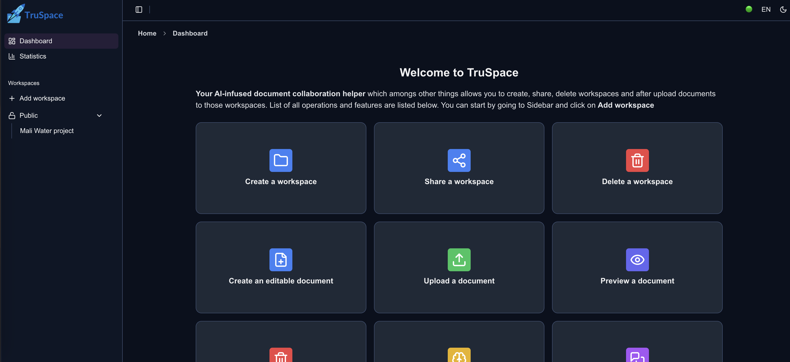

If something doesn't work, check that all containers are running with `docker ps`. They should show these containers:
| CONTAINER ID | IMAGE | COMMAND | CREATED | STATUS | PORTS | NAMES |
|--------------|--------------------------------------|--------------------------|------------------|--------------------------|--------------------------------------------------------------------------------------------------|---------------------|
| 14f... | ghcr.io/open-webui/open-webui:main | "bash start.sh" | 26 minutes ago | Up 26 minutes (healthy) | 0.0.0.0:3333->8080/tcp | truspace-webui-1 |
| 412... | ipfs/ipfs-cluster:latest | "/usr/bin/tini -- /u…" | 26 minutes ago | Up 26 minutes | 0.0.0.0:9094->9094/tcp, 0.0.0.0:9096-9097->9096-9097/tcp, 9095/tcp | cluster0 |
| 7b4...| truspace-backend | "sh ./entrypoint.sh" | 26 minutes ago | Up 26 minutes | 0.0.0.0:8000->8000/tcp | truspace-backend-1 |
| 783... |truspace-frontend | "sh startup.sh" | 26 minutes ago | Up 26 minutes (healthy) | 0.0.0.0:3000->3000/tcp, :::3000->3000/tcp | truspace-frontend-1|
| 590... | ipfs/kubo:release | "/sbin/tini -- /usr/…" | 26 minutes ago | Up 26 minutes (healthy) | 0.0.0.0:4001->4001/tcp, 0.0.0.0:5001->5001/tcp, 4001/udp, 0.0.0.0:8080->8080/tcp, 8081/tcp | ipfs0 |

</details>

<br>

> [!NOTE]
> For more details on the installation, feel free to check out our detailed installation guide [here](https://web.truspace.dev/site/getting-started/installation/).

### 🧰 Tech Stack and Architecture overview

| Layer                 | Technologies                                                                                                                                                                                                                                                                                                                                                                                                                                                                                                                |
| --------------------- | --------------------------------------------------------------------------------------------------------------------------------------------------------------------------------------------------------------------------------------------------------------------------------------------------------------------------------------------------------------------------------------------------------------------------------------------------------------------------------------------------------------------------- |
| Frontend              | [](https://www.typescriptlang.org/) [](https://reactjs.org) [](https://nextjs.org) [](https://www.radix-ui.com/) |
| Backend               | [](https://www.typescriptlang.org/) [](https://expressjs.com)                                                                                                                                                                                                                                   |
| Decentralized storage | [](https://ipfs.tech) [](https://ipfscluster.io)                                                                                                                                                                                                                                                                                      |
| User Database         | [](https://sqlite.org)                                                                                                                                                                                                                                                                                                                                                                                                 |
| LLM Engine            | [](https://ollama.com)                                                                                                                                                                                                                                                                                                                                                                                                                             |
| AI API and RAG        | [](https://openwebui.com)                                                                                                                                                                                                                                                                                                                                                                                                            |
| Containerization      | [](https://www.docker.com/)                                                                                                                                                                                                                                                                                                                                                                                            |

In the overview, you can see how the components work together. The UI and API is part of this repository and provides the interface and the translation to other services. Once you start TruSpace, it pulls and connects to containers from Open Web UI (for AI processing) and IPFS/IPFS-Cluster to persist the data. The respective ports are outlined in the image.

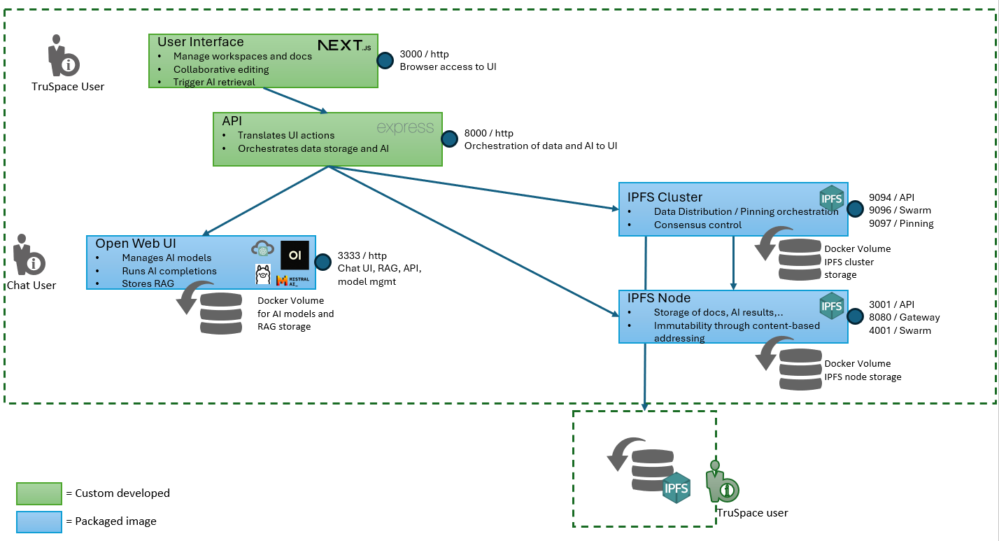

### Data model for workspaces in IPFS

The data model has a hierarchical structure of workspaces, documents and metadata. They are linked using UUIDs in the metadata-fields of the IPFS files. Each data entry is a single (small) file to avoid merge conflicts in the IPFS network, e.g. in case of network split. The concept is outlined in the visual representation of the [Data model](./doc/images/datamodel.png "Data model")

The specific fields are described in [backend/src/types/interfaces/truspace.ts](backend/src/types/interfaces/truspace.ts)

### IPFS Sync for the decentralization of data

- Ideally, each organization runs its own node
- Nodes automatically replicate documents and metadata (e.g. chats, versions, AI perspectives) within the network
- Pinning is orchestrated via IPFS Cluster to ensure data availability
- Fault-tolerant and censorship-resistant architecture

### Security & Data Privacy

- Sensitive data (e.g. login credentials) is stored encrypted in **SQLite** on the local node
- Documents are synced only to **trusted IPFS peers**, IPFS can be configured as private network by default
- All inter-node communications are encrypted
- Documents are encrypted with workspace ID

## 🤝 Contribution Guide

We welcome contributions! Please read the [CONTRIBUTING.md](CONTRIBUTING.md) and the [Developer Guide](https://web.truspace.dev/site/guides/developer/) for:

- Setting up a development environment
- Reporting issues and submitting pull requests
- Code style guidelines

To inspire contributers and make it easier to get started, we have visualized our 2 main goals for TruSpace in the near future and respective features that will help us get there:
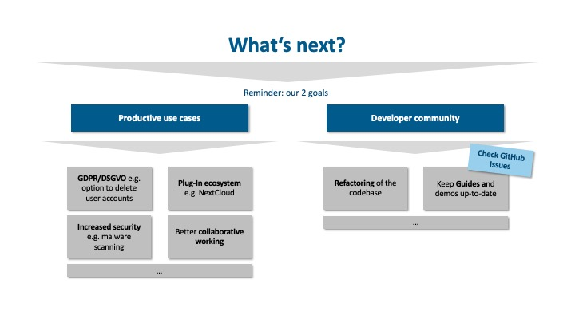

## 📜 License

This project is licensed under the **GNU General Public License v3.0**. See the [LICENSE](./LICENSE) file for details.

## 💬 Community & Support

- User guide: [User Guide](https://web.truspace.dev/site/guides/user/)
- Developer guide: [Developer Guide](https://web.truspace.dev/site/guides/developer/)
- Admin guide: [Admin Guide](https://web.truspace.dev/site/guides/admin/)
- Discussions: [GitHub Discussions](https://github.com/openkfw/TruSpace/discussions)
- Report issues: [GitHub Issues](https://github.com/openkfw/TruSpace/issues)
- Intro Story to get what it's about: [Medium Blog](https://medium.com/@angryarchitect/your-place-or-my-place-a-tale-of-decentralization-and-sovereignty-c775dafbadbb)
