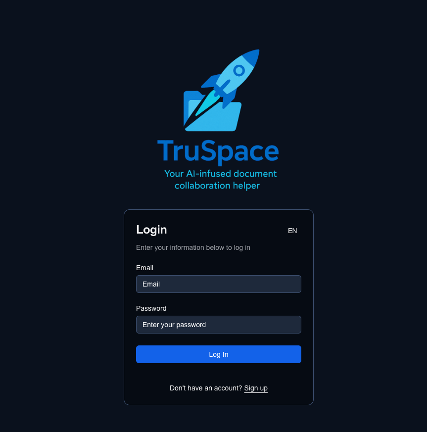

# 🌐 TruSpace - an ai-infused, decentralized and sovereign document workspace

The purpose of TruSpace is to make collaboration on documents between several stakeholders more efficient while making the respective data sovereign to all participants. It uses AI to support document interpretation and decentralization to stay in control of your data.

**Collaborative, decentralized document sharing and editing platform** built with **Next.js**, **Express.js**, **SQLite**, and **IPFS Cluster**. Enhanced with local LLM capabilities via **Ollama**, **Open Web UI** and a nice web-interface.

---

## ✨ Key Features

- 🆓 100% open-source, sovereign and self-hostable - no cloud provider needed
- 🔄 Fully decentralized storage using IPFS Cluster: Automatic sync of data between trusted IPFS cluster nodes/partners (private or public setup)
- 🧠 Local AI interpretation of documents using Ollama + Open Web UI using customisable pre-defined prompts
- 🗂️ Workspace-based organization of content and participants

---

## Quick start, I want to..

- 🧪 [Play around in a sandbox demo environment](#play-around-in-an-online-sandbox-demo-environment)
- 💻 [Run it locally on my machine](#-run-it-locally-on-my-machine)
- 🛠️ [Install a standalone server](#install-a-standalone-server)
- 🌐 [Connect to other TruSpace nodes](#connect-to-other-truspace-nodes)
- 📚 [Check out architecture, guides, details](#check-out-architecture-guides-details)

---

## Play around in an online sandbox demo environment

To check how TruSpace works, get to the sandbox installation at https://truspace.dev, register a new user, login and start playing with private and public workspaces! It's an experiment-sandbox, so your data might get deleted occasionally.

---

## 📥 Run it locally on my machine

For a very **quick and easy** TruSpace setup (e.g. for demos and first look) on your local machine using `localhost`, run:

```bash
git clone git@github.com:openkfw/TruSpace.git
cd TruSpace
./start.sh
```

This command creates a simple environment configuration, creates docker volumes and spins up `docker compose` containing backend api and IPFS clusters and additionally NextJS frontend in dev mode. After startup, the frontend is available on `http://localhost:3000`. Register a user, login and create a workspace for documents!

If you plan to use another domain (e.g. on a local raspberry), make sure that the respective domains are updated from `localhost` to your `domain.local` in the `CORS` fields of the `.env` file (`CORS_ORIGIN` and `OI_CORS_ALLOW_ORIGIN`). This can be easily done in the `TruSpace` folder using the example environment:

```bash
sed 's|http://localhost|http://example.com|g' .env.example > .env
```

To enable AI analysis, TruSpace downloads a model configured in `.env`, as an example here is `gemma3:1b` and you can see the full list at the [ollama DB](https://ollama.com/library?q=mistral&sort=popular).

Once the model is downloaded, AI analysis is executed upon each document upload automatically.

**You made it and should see this**



There'se an option to change the app langugae, too. Go ahead and _Sign up_ a new user.


Fill out the required fields. The user account is local, your data is not going anywhere. After the submission, the app takes you back to the login screen, and from there to the dashboard.


If something doesn't work, check that all containers are running with `docker ps`. They should show these containers:
| CONTAINER ID | IMAGE | COMMAND | CREATED | STATUS | PORTS | NAMES |
|--------------|--------------------------------------|--------------------------|------------------|--------------------------|--------------------------------------------------------------------------------------------------|---------------------|
| 14f... | ghcr.io/open-webui/open-webui:main | "bash start.sh" | 26 minutes ago | Up 26 minutes (healthy) | 0.0.0.0:3333->8080/tcp | truspace-webui-1 |
| 412... | ipfs/ipfs-cluster:latest | "/usr/bin/tini -- /u…" | 26 minutes ago | Up 26 minutes | 0.0.0.0:9094->9094/tcp, 0.0.0.0:9096-9097->9096-9097/tcp, 9095/tcp | cluster0 |
| 7b4...| truspace-backend | "sh ./entrypoint.sh" | 26 minutes ago | Up 26 minutes | 0.0.0.0:8000->8000/tcp | truspace-backend-1 |
| 783... |truspace-frontend | "sh startup.sh" | 26 minutes ago | Up 26 minutes (healthy) | 0.0.0.0:3000->3000/tcp, :::3000->3000/tcp | truspace-frontend-1|
| 590... | ipfs/kubo:release | "/sbin/tini -- /usr/…" | 26 minutes ago | Up 26 minutes (healthy) | 0.0.0.0:4001->4001/tcp, 0.0.0.0:5001->5001/tcp, 4001/udp, 0.0.0.0:8080->8080/tcp, 8081/tcp | ipfs0 |

---

## Install a standalone server

There's an extensive guide how to install TruSpace on a (virtual) server or a Raspberry Pi. It includes steps how to install surrounding architecture like docker, a reverse proxy `nginx`, certificates via `LetsEncrypt` and all the other administrative steps. Have a look [here](./doc/installStandaloneServer.md) for a standalone server or [here](./doc/installRaspberryPi.md) for a setup on Raspberry Pi.

---

## Connect to other TruSpace nodes

You have a TruSpace node running and would like to connect to another (private) network to sync the TruSpace data? It's simple - but you need to exchange some configuration values in order to have a secure private connection. The connection requires to

- Retrieve the **IP address(es)** of the target node to connect to
- The **swarm key** to allow the IPFS nodes to connecto to each other without sharing the connection with anyone else
- The **IPFS id** identifies the IPFS node in the network
- The **cluster secret** to allow the IPFS cluster to share the pinning information which files should be shared between the nodes
- The **cluster id** identifies the cluster in the network

Here is a step by step guide:

- From the node at which you want to connect to (**target node**), get the file `swarm.key` from the folder `./volumes/ipfs0/swarm.key`. It should look approximately like this

```
/key/swarm/psk/1.0.0/
/base16/
7c2c973709f5a961b.....8926a65b15477cf5
```

- Copy the file into your `./volumes/ipfs0/` folder and overwrite the existing `swarm.key`, i.e. `./volumes/ipfs0/swarm.key`

- Obtain the cluster secret from the target node you want to connect to. It is the environment variable `CLUSTER_SECRET`, e.g. found in the `./.env` configuration of the target node.
- This should be copied in your `./.env` file in the variable `CLUSTER_SECRET`. This enables the two cluster nodes to connect to each other.

- On the target node, open the file `/volumes/cluster0/identity.json`. Copy the value in the field `id`, you can do this using `jq` command or simply read it out:

```bash
# Fetch values
MY_IP="$(curl -s https://api.ipify.org)"
IPFS_ID="$(jq -r '.Identity.PeerID' ./volumes/ipfs0/config)"
CLUSTER_ID="$(jq -r '.id' ./volumes/cluster0/identity.json)"

# Print with nice formatting
printf "\n"
printf "🖧  My IP Address:\n"
printf "    %s\n\n" "$MY_IP"

printf "🛰  IPFS PeerID:\n"
printf "    %s\n\n" "$IPFS_ID"

printf "📡  Cluster PeerID:\n"
printf "    %s\n\n" "$CLUSTER_ID"

```

- Use the script `./connectNodes.sh` to modify the respective files for IPFS and Cluster. The script uses the IP address and the respective `id` values and inserts them into the configuration files `./volumes/ipfs0/config` and `./volumes/cluster0/service.json`. If you prefer to do this manually on your installation, open the file `/volumes/cluster0/service.json` and search for the field `peer_addresses`. If you haven't connected to other nodes before, it is `"peer_addresses": []`. Enter the target node IP address and the node `id` that you retrieved before in this field, e.g. `"peer_addresses": []`. IPFS uses the multiaddress format, e.g. it is `"peer_addresses":["/ip4/192.168.1.100/tcp/9096/p2p/target_ID"]`. Do not forget to use `"` around the peer.

- Restart all containers using `./start.sh` script

- Validate that the peers are available for both ipfs and cluster services. Both command should return peers for the IPFS network and the cluster network:

```bash
docker exec ipfs0 ipfs swarm peers
```

```bash
docker exec cluster0 ipfs-cluster-ctl peers ls
```

## Check out architecture, guides, details..

### Run development environment for coding

For an installation guide in a development setup, please see [Installation and running of local environment](./doc/DEV_INSTALLATION.md)

### ⚙️ Environment Variables

This project uses a set of environment variables to configure its frontend, backend, IPFS, and AI components.

For a complete reference and description of all variables, see  
➡️ [ENVIRONMENT_VARIABLES.md](./doc/ENVIRONMENT_VARIABLES.md)

### 🧑‍💻 User Guide

An extensive user guide with screenshots is available in the folder [User Guide](./doc/User%20Guide/)

### Tech Architecture overview

In the overview, you can see how the components work together. The UI and API is part of this repository and provides the interface and the translation to other services. Once you start TruSpace, it pulls and connects to containers from Open Web UI (for AI processing) and IPFS/IPFS-Cluster to persist the data. The respective ports are outlined in the image.

For the connection to other nodes, ports 4001 (IPFS swarm) and 9096/9097 (IPFS cluster) need to be opened.


### 🧰 Tech Stack

| Layer          | Technology                                                          |
| -------------- | ------------------------------------------------------------------- |
| Frontend       | [Next.js](), [Radix UI](https://www.radix-ui.com/)                  |
| Backend        | [Express.js](https://expressjs.com/)                                |
| Database       | [SQLite](https://sqlite.org/)                                       |
| Decentralized  | [IPFS](https://ipfs.tech/), [IPFS Cluster](https://ipfscluster.io/) |
| LLM Engine     | [Ollama](https://ollama.com/)                                       |
| AI API and RAG | [Open Web UI](https://openwebui.com/)                               |

### Data model for workspaces in IPFS

The data model has a hierarchical structure of workspaces, documents and metadata. They are linked using UUIDs in the metadata-fields of the IPFS files. Each data entry is a single (small) file to avoid merge conflicts in the IPFS network, e.g. in case of network split. The concept is outlined in the visual representation of the [Data model](./doc/datamodel.png "Data model")

The specific fields are described in [backend/src/types/interfaces/truspace.ts](backend/src/types/interfaces/truspace.ts)

### 🔄 IPFS Sync for the decentralization of data

- Each organization runs its own node
- Nodes automatically replicate documents and metadata (e.g. chats, versions, AI perspectives) within the network
- Fault-tolerant and censorship-resistant

TODO

### 🔐 Security & Data Privacy

- Sensitive data (e.g. login credentials) is stored encrypted in **SQLite** on the local node
- Documents are synced only to **trusted IPFS peers**, IPFS can be configured as private network by default
- All inter-node communications are encrypted
- Documents are encrypted with workspace ID

## 🤝 Contribution Guide

We welcome contributions! Please read the [CONTRIBUTING.md](CONTRIBUTING.md) for:

- Setting up a development environment
- Reporting issues and submitting pull requests
- Code style guidelines

---

## 🛣 Roadmap

- [ ] Real-time collaboration with CRDTs
- [ ] Role-based access controls
- [ ] Federated identity system
- [ ] Mobile-friendly UI
- [ ] Plugin system for document types and AI models

---

## 📜 License

This project is licensed under the **GNU General Public License v3.0**. See the [LICENSE](./LICENSE) file for details.

---

## 💬 Community & Support

- User guide: [User Guide](./doc/User%20Guide/README.md)
- Discussions: [GitHub Discussions](https://github.com/openkfw/TruSpace/discussions)
- Report issues: [GitHub Issues](https://github.com/openkfw/TruSpace/issues)
