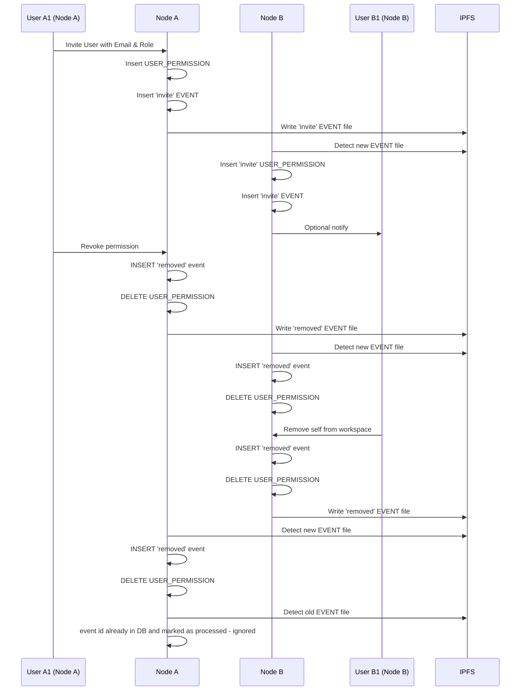

# Proposal: Private Workspace Permissions Across IPFS Nodes (#292)

---

## **Problem**

Currently, it is not possible for a user on Node A (A1) to create a private workspace and grant access to a user on Node B (B1):

- User management and access rights are **stored locally per node**.
- Adding a user from another node only updates the local database on the inviter’s node.
- The remote node has no record of this permission, so the invited user cannot access the workspace.

**Constraints**:

- Each node must remain the authoritative source for its local users and permissions.
- Users are identified **globally by email**, which may leave the node as part of the invite.
- Invitations are **sent one at a time**; the inviter must know the email of the person they are inviting.

---

## **Proposed Solution**

Introduce a **cross-node invitation system** based on **USER_PERMISSIONS** as a materialized view and a **generic EVENTS table** for syncing, using **email addresses as the global identifier**.

### **Workflow Overview: Auto-Accept Invitations**

1. **User A selects workspace**

- User A on Node 1 selects their private workspace.

2. **Send invite**

- User A enters the email of User B (who may be on a different node).
- The system sends the invitation.

3. **Create local user_permission**

- A `USER_PERMISSIONS` record is created on Node A for the invited email.

4. **Log event**

- An `EVENT` record is created locally and written to the IPFS event bus.
- The event contains:
  - `id` — generated by combining the nodeid + uuid
  - `entity_type` — e.g., `permission`
  - `entity_id` — unique ID of the affected entity (invite ID, workspace ID)
  - `entity_event` — `invited`, `revoked`, `removed`
  - `created_at` — timestamp
  - `processed` — boolean flag

5. **Remote nodes process event**

- Other nodes detect the new IPFS event file (ideally triggered by file creation).
- The backend of each node reads and triggers the event.

6. **Create remote user_permission**

- Each node writes a `USER_PERMISSIONS` record for the invited email in its local database.

7. **Record the event locally**

- Each node also writes the corresponding `EVENT` record in its local database.

8. **Optional notification**

- If a local user exists with the invited email, a `NOTIFY` record is created to inform them of the new workspace access.

---

## **Full Lifecycle Sequence Diagram**

---

## **Proposed Database Changes**

### **USER_PERMISSIONS table (updated)**

- `last_event_id` — tracks the latest event ID for this permission

**Behavior:**

- One row per `(workspace_id, user_email)`
- Updated via local actions or events from IPFS

---

### **EVENTS table (new)**

- `id` — generated by combining the nodeid + uuid
- `entity_type` — e.g., `permission`, `workspace`
- `entity_id` — unique ID of the affected entity (invite ID, workspace ID)
- `entity_event` — `invited`, `revoked`, `removed`
- `payload` — JSON with additional metadata
- `created_at` — timestamp
- `processed` — boolean flag

**Behavior:**

- Append-only log
- Events are replayed for offline nodes
- Ensures **idempotent permission application**

---

### **Pros / Cons**

**Pros:**

- Each node maintains authoritative control over its users and permissions
- Email enables global permission identification across nodes
- Offline-safe via IPFS event replay
- Extensible for notifications, expirations, role changes, and revocations
- Auto-accept simplifies workflow (no pending state)

**Cons / Considerations:**

- Emails are sent across nodes; users must understand this in privacy policy
- Requires a **event system** using IPFS
- UI must handle active permissions, revocations, and self-removals
- Optional: notify origin node when remote users are granted access
