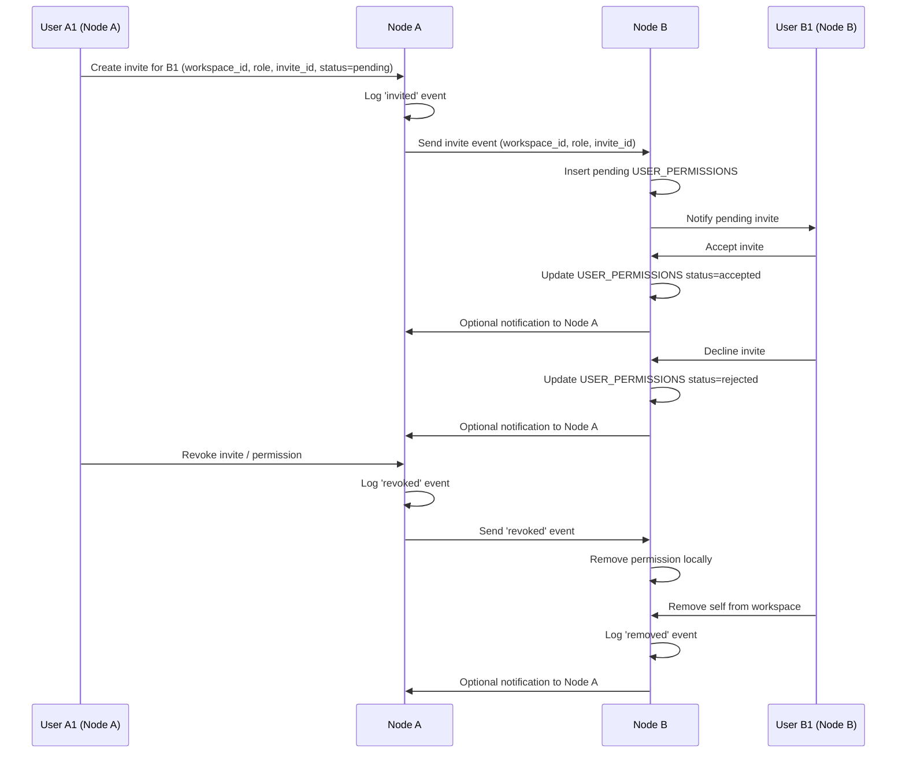
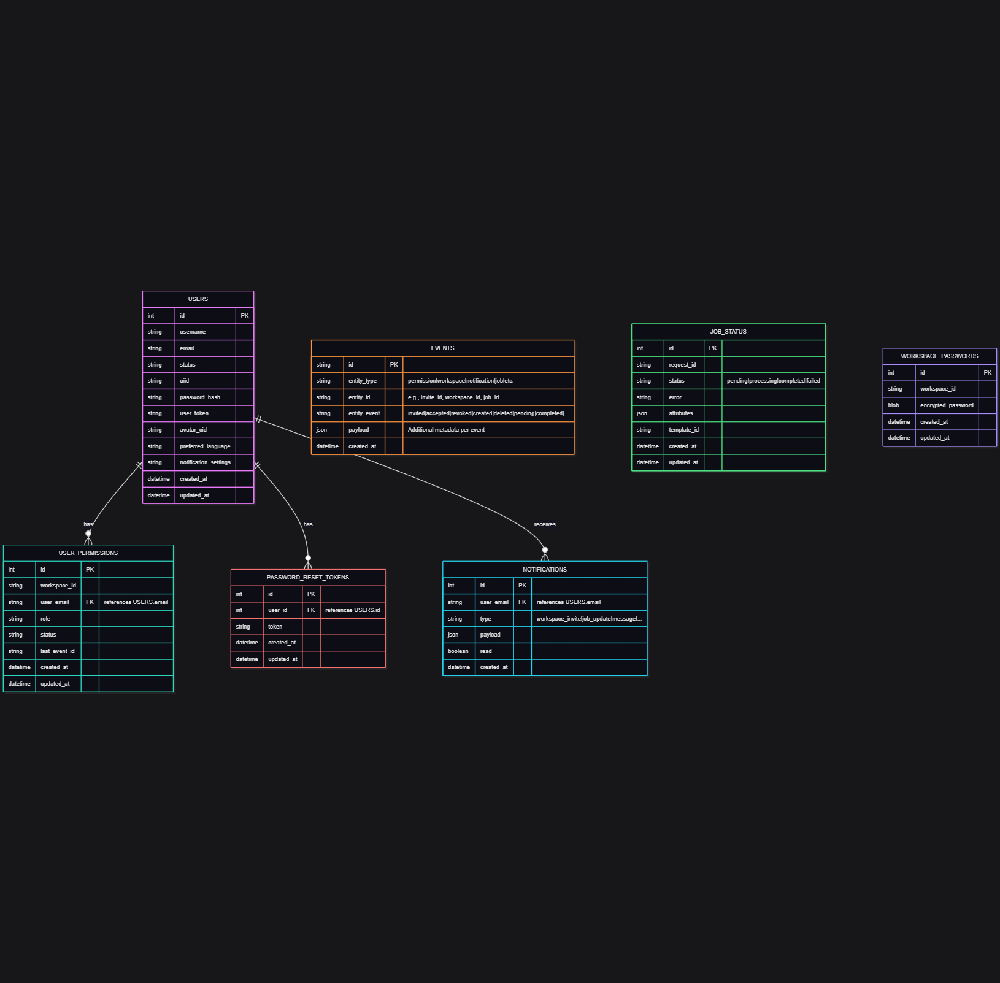

# Proposal: Private Workspace Permissions Across IPFS Nodes (#292)

---

## **Problem**

Currently, it is not possible for a user on Node A (A1) to create a private workspace and grant access to a user on Node B (B1):

- User management and access rights are **stored locally per node**.
- Adding a user from another node only updates the local database on the inviter’s node.
- The remote node has no record of this permission, so the invited user cannot access the workspace.

**Constraints**:

- User personal data **must not leave their home node** (DSGVO / privacy compliance).
- Each node must remain the authoritative source for its local users and permissions.

---

## **Proposed Solution**

Introduce a **cross-node invitation system** based on **USER_PERMISSIONS** as a materialized view and a **generic EVENTS table** for syncing.

### **Workflow Overview**

1. **Invite a user**

- A1 (Node A) wants to invite another user:
  - **Local user**: A2 (Node A)
  - **Remote user**: B1 (Node B)
- A1 selects the workspace, role, and target user/node.
- The system generates a **unique invite ID** and creates a `USER_PERMISSIONS` entry with `status = pending` on Node A (for local view) and an `invited` event in `EVENTS`.

---

2. **Deliver invite to target node**

- Node A sends an **event** to Node B containing:
  - `invite_id`
  - `workspace_id`
  - role
- No personal data from Node A leaves the node.
- Node B inserts a corresponding **USER_PERMISSIONS** row with `status = pending` and logs the event locally.

---

3. **Invite acceptance / rejection**

- B1 logs in to Node B and sees pending invitations.
- Accepting the invite updates `USER_PERMISSIONS` on Node B:
  - `status = accepted`
  - Role and workspace information applied
- Declining updates status to `rejected`.
- Node B generates an event (`accepted` or `rejected`) and optionally notifies Node A.

---

4. **Invite revocation**

- A1 can revoke a pending invite or an accepted permission:
  - Updates local `USER_PERMISSIONS` to remove the user
  - Logs a `revoked` event
  - Remote node updates its `USER_PERMISSIONS` when the event is received

---

5. **Self-removal / workspace exit**

- Any user (A2 or B1) can remove themselves from a workspace:
  - Updates local `USER_PERMISSIONS`
  - Logs a `removed` event for sync

---

### **Offline / Sync Considerations**

- Events are **queued** in `EVENTS` until the target node is online.
- Offline nodes replay events to reconstruct `USER_PERMISSIONS` state.
- Each event has a unique `invite_id` or entity ID to ensure **idempotency** and prevent duplicate entries.

---

## **Full Lifecycle Sequence Diagram**

This diagram shows the entire invite process across nodes, including acceptance, rejection, revocation, and self-removal:

---

## **Proposed Database Changes**

### **USER_PERMISSIONS table (updated)**

- `node_id` — identifies which node the user belongs to
- `last_invite_id` — tracks the latest invite ID for this permission
- `status` — expanded to include `pending`, `accepted`, `rejected`, `removed`
- One row per `(workspace_id, node_id, user_id)`
- Updated via local actions or events from other nodes

---

### **EVENTS table (new)**

- `id` — primary key
- `entity_type` — e.g., `permission`, `workspace`
- `entity_id` — unique ID of the affected entity (invite ID, workspace ID)
- `event_type` — `invited`, `accepted`, `rejected`, `revoked`, `removed`
- `payload` — JSON with additional metadata
- `source_node_id` — node where the event originated
- `target_node_id` — node that should apply the event
- `created_at` — timestamp
- `processed` — boolean flag

**Behavior:**

- Append-only log
- Events are replayed for offline nodes
- Ensures **idempotent permission application**

---

### **Pros / Cons**

**Pros:**

- Preserves DSGVO compliance: no personal data leaves a node
- Each node maintains authoritative control over its users and permissions
- Offline-safe via **EVENTS replay**
- Extensible for notifications, expirations, role changes, and revocations

**Cons / Considerations:**

- Requires a **notification/event system** between nodes
- UI must handle pending invites, acceptance, and rejection statuses
- Optional: notify origin node when remote users accept/reject invites
