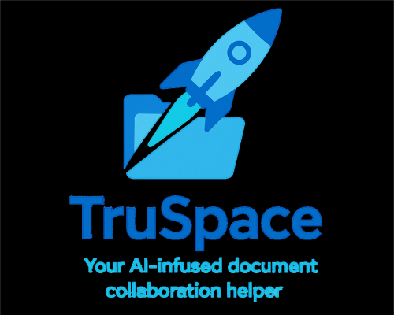

    

# Welcome to the TruSpace Developer Guide!

**TruSpace** is an open-source platform designed to enable **sovereign**, **decentralized**, and **intelligent** document collaboration between individuals and organizations.

Our developer guide should assist you in using TruSpace and help in answering the following questions:

- [Code of Conduct](Code%20of%20Conduct.md): What are the expectations for behavior in the TruSpace community?
- [Codebase structure](Codebase%20structure.md): How is the TruSpace codebase organized?
- [Setting up development environment](Setting%20up%20Development%20Environment.md): How do I set up my development environment to contribute to TruSpace?
- [How to contribute](How%20to%20contribute/Git%20commits,%20branches%20and%20workflow.md): How can I contribute to the TruSpace project?
- [Testing TruSpace](Testing%20TruSpace.md): How do I test TruSpace to ensure it works correctly?
- [Logging TruSpace](Logging%20TruSpace.md): How is logging handled in TruSpace?

> [!NOTE]
> TruSpace is currently in active development. The application is being continuously improved, and new features are being added. The user guide will be updated accordingly to reflect these changes. If you have any suggestions or feedback, please feel free to reach out to us.
