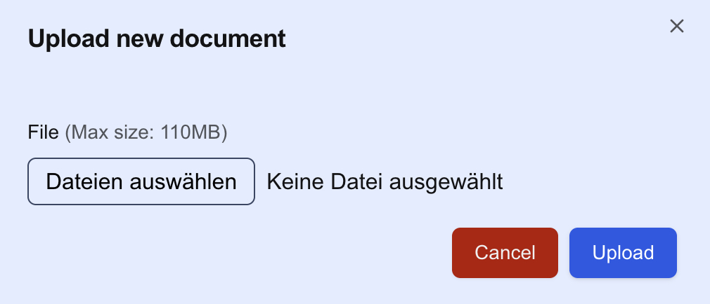

# Create or upload a document

1. Make sure you are in the workspace where you want to create or upload a document.
2. You can now select whether to create or upload a document:

    

   - **Create** (textual) document:

   - **Upload** document (maximum of 110MB):

Afterwards, you should see the new document listed in the workspace.