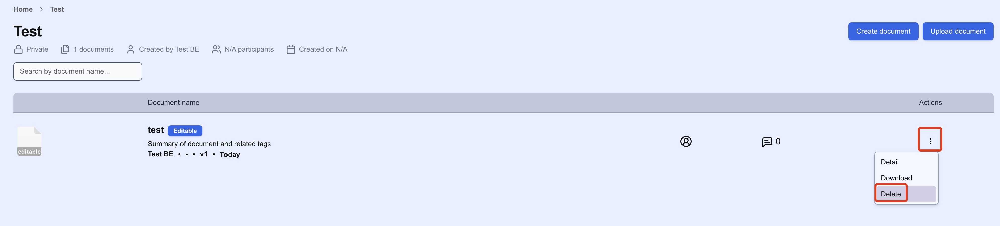

# Delete a document

1. Make sure you are in the workspace where you want to delete a document.
2. Click on the action menu in the document and delete it:
    

You have now successfully deleted the document from the workspace. Please note that this action is irreversible, and the document will be permanently removed.