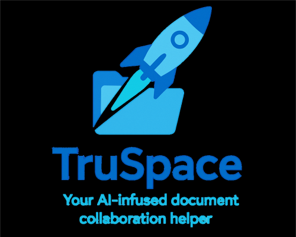

    

# Welcome to the TruSpace User Guide!

**TruSpace** is an open-source platform designed to enable **sovereign**, **decentralized**, and **intelligent** document collaboration between individuals and organizations.

Our user guide should assist you in using TruSpace and help in answering the following questions:

- [Use cases](Use%20cases.md): Why should I use TruSpace? How can I integrate it into my workflow?  
- [Workspaces](Workspaces/How%20to%20use%20workspaces.md): How can I manage workspaces?  
- [Documents](Documents/About%20documents.md): How can I manage documents? How can I collaborate on them? 
- [Users and access rights](Users%20and%20access%20rights.md): How can I manage the access to workspaces?  
- [Terminologies](Terminologies.md): What do certain terms mean?  
- [Feature requests and bug reports](Feature%20requests%20and%20bug%20reports.md): Where can I request features? Or report bugs?

> [!NOTE]
> TruSpace is currently in active development. The application is being continuously improved, and new features are being added. The user guide will be updated accordingly to reflect these changes. If you have any suggestions or feedback, please feel free to reach out to us.