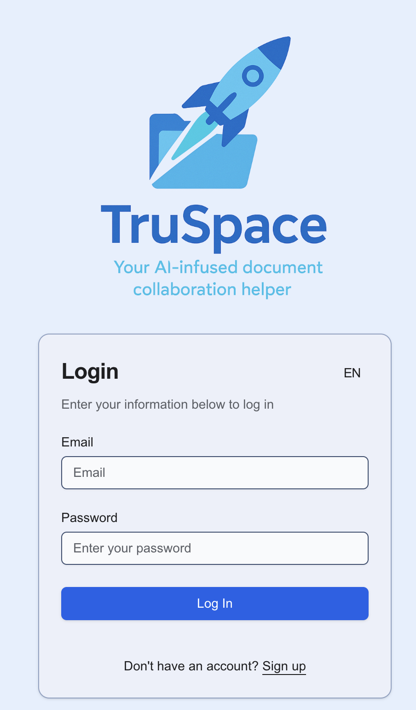
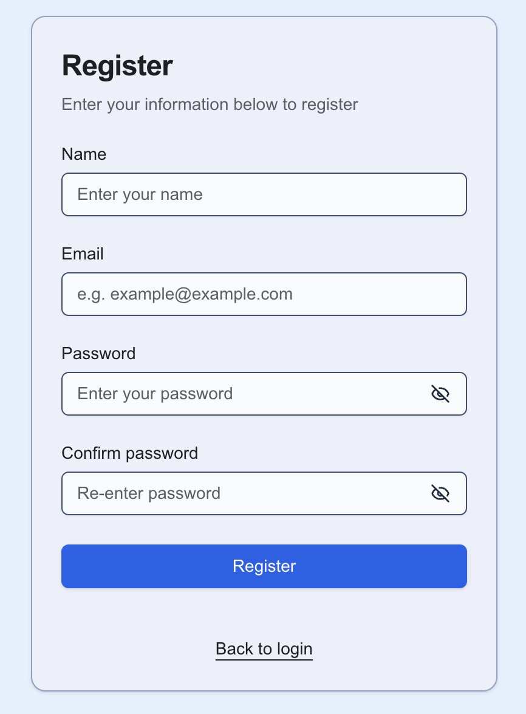
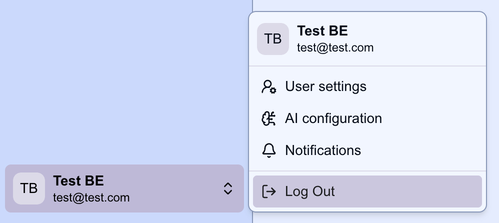

# Login / Register & Logout

To access the TruSpace application, you need to create a user account with a user name, email address and password. This allows for secure access to your private workspaces as well as public workspaces.

## Login

1. Open the TruSpace application in your web browser.
2. Enter your credentials in the login form:

If your credentials are correct, you will be redirected to the home page of the TruSpace application, where you can see your workspaces and documents.

## Register

1. If you do not have an account yet, click on the "Sign up" link in the login form.
2. Fill in the registration form with your desired username, email address, and password:

3. After filling in the form, click on the "Register" button. You will be redirected to the login page.

## Logout

1. To log out of the TruSpace application, click on your username in the bottom left corner of the sidebar.
2. Select the "Log Out" option from the dropdown menu:

You will be logged out and redirected to the login page.
