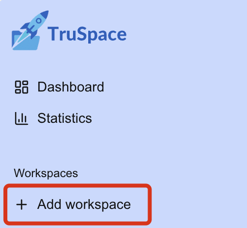
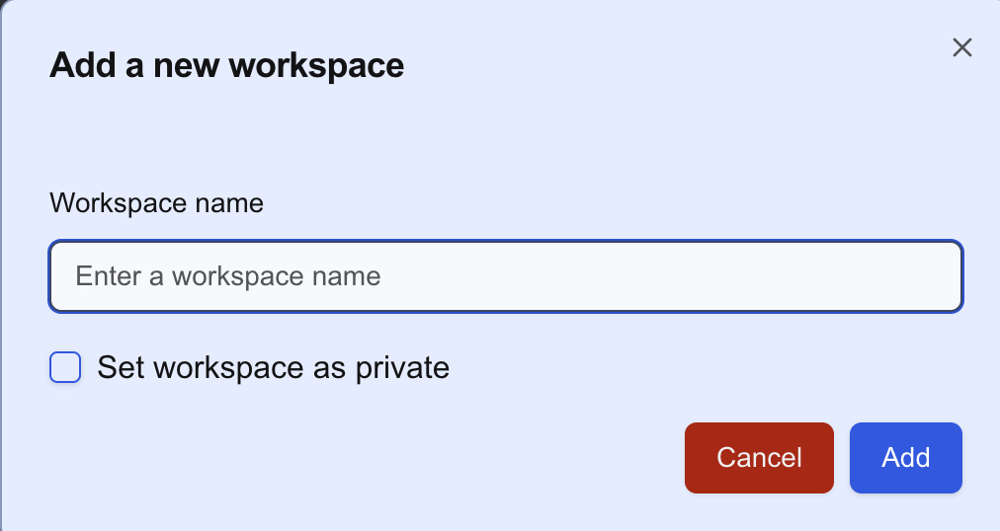
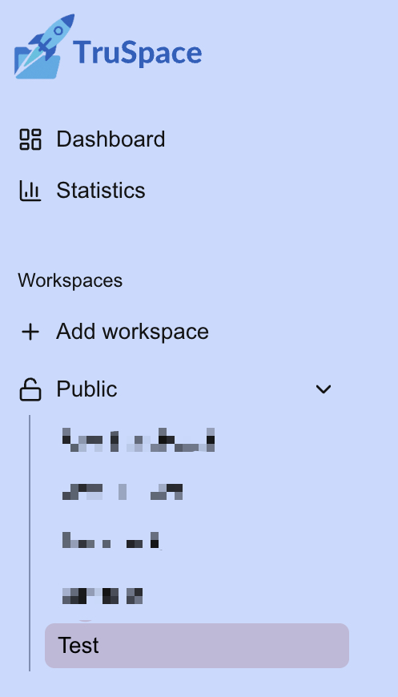

# Create a workspace

1. You can create a new workspace by adding it in the sidebar on the left:

    

2. Afterwards, a dialog will be opened where you can 
   - name the workspace
   - set it as private (read more [here](Public%20vs%20private%20workspaces.md))

    

3. After adding the workspace, you should now be able to see and access it in the sidebar:

    

You have now successfully created a new workspace!