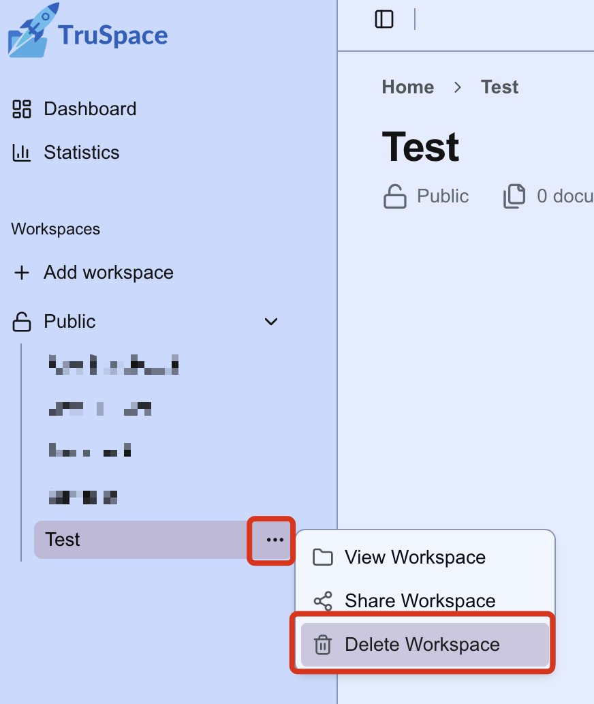
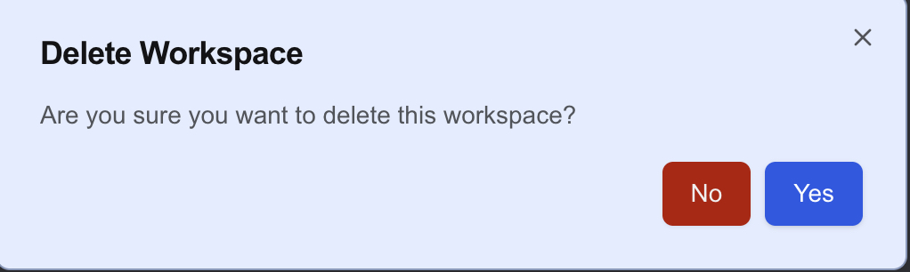

# Delete a workspace

1. To delete a workspace, hover over the target workspace in the sidebar and press the three option buttons

    

2. Before the workspace is entirely deleted, you will be asked to confirm this action:

    

You have now successfully deleted the workspace!