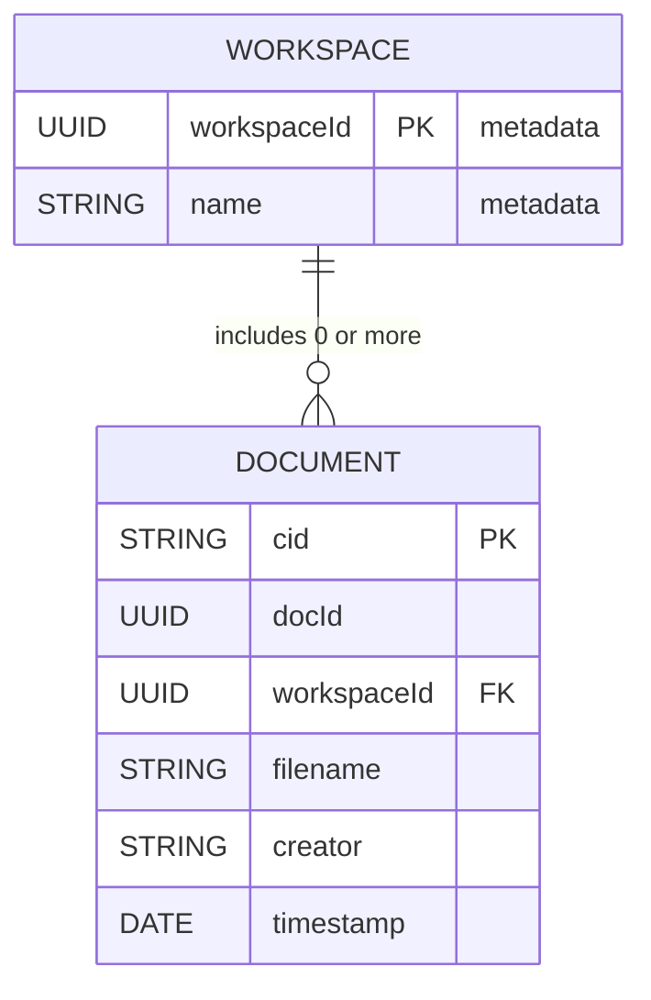

# Datamodel

UUID workspaceId "primary"
STRING name

```mermaid
erDiagram
    WORKSPACE {
        UUID workspaceId PK "metadata"
        STRING name "metadata"
    }
    DOCUMENT {
        STRING cid PK
        UUID docId
        UUID workspaceId FK
        STRING filename
        STRING creator
        DATE timestamp
    }
    

    WORKSPACE ||--o{ DOCUMENT : "includes 0 or more"
   
```

