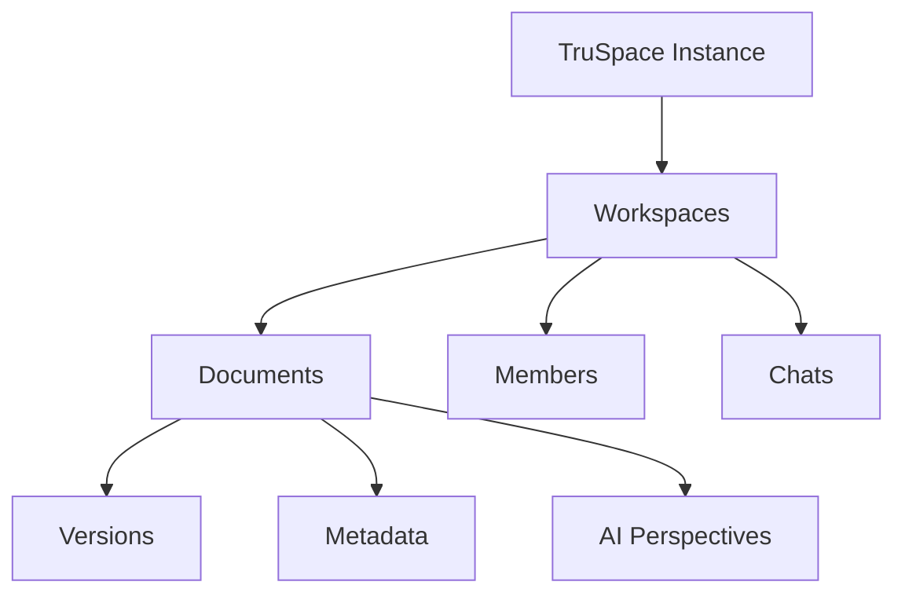

# Data Model

How TruSpace organizes and stores data.

## Hierarchical Structure



## Core Entities

### Workspace

| Field | Type | Description |
|-------|------|-------------|
| `id` | UUID | Unique identifier |
| `name` | string | Workspace name |
| `visibility` | enum | public/private |
| `createdAt` | timestamp | Creation time |
| `ownerId` | UUID | Creator reference |

### Document

| Field | Type | Description |
|-------|------|-------------|
| `id` | UUID | Unique identifier |
| `workspaceId` | UUID | Parent workspace |
| `name` | string | File name |
| `cid` | string | IPFS content ID |
| `mimeType` | string | File type |
| `size` | number | File size in bytes |
| `encryptionKey` | string | Workspace-derived key |

### AI Perspective

| Field | Type | Description |
|-------|------|-------------|
| `id` | UUID | Unique identifier |
| `documentId` | UUID | Parent document |
| `promptId` | string | Prompt template used |
| `content` | string | AI-generated content |
| `model` | string | LLM model used |

## Storage Strategy

### SQLite (Local)

- User credentials
- Session data
- Local preferences

### IPFS (Distributed)

- Documents (encrypted)
- Workspace metadata
- AI perspectives
- Version history

Each piece of data is stored as a separate small file to prevent merge conflicts in distributed scenarios.

## Linking via UUIDs

All entities are linked using UUIDs in IPFS metadata fields:

```json
{
  "type": "document",
  "id": "550e8400-e29b-41d4-a716-446655440000",
  "workspaceId": "550e8400-e29b-41d4-a716-446655440001",
  "cid": "QmXnnyufdzAWL5CqZ2RnSNgPbvCc1ALT73s6epPrRnZ1Xy"
}
```
