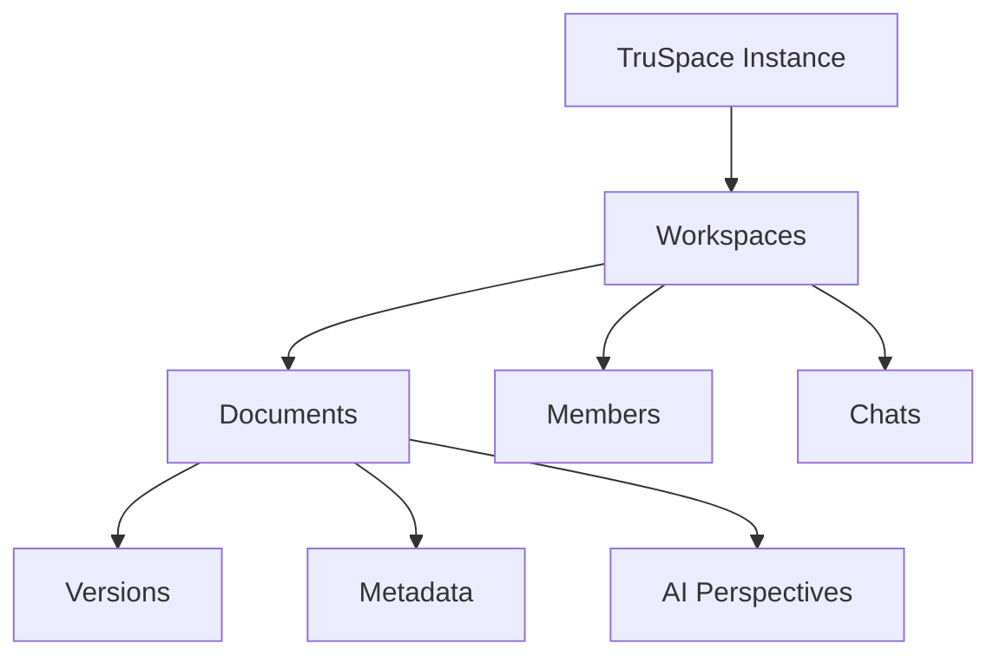
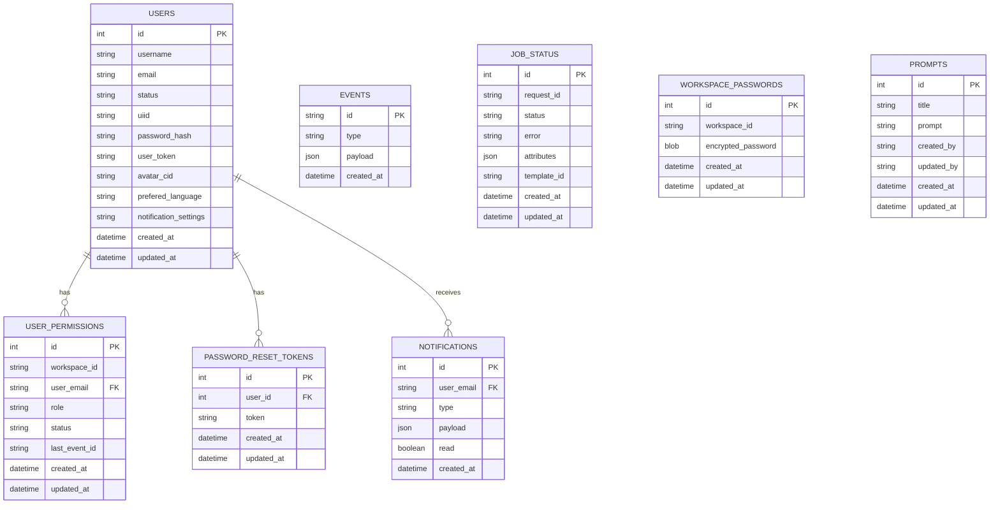

# Data Model

TruSpace uses a two-tier storage strategy: **SQLite** for local, node-specific data and **IPFS** for all distributed, replicated content. This separation keeps sensitive identity data local while enabling seamless document sync across nodes.

---

## Storage Strategy

| Data Type | Storage | Encrypted | Synced |
|---|---|---|---|
| User credentials | SQLite | ✓ (bcrypt) | ✗ |
| User profiles & sessions | SQLite | ✗ | ✗ |
| Workspace passwords | SQLite | ✓ (AES blob) | ✗ |
| Permission events | SQLite + IPFS | ✗ | ✓ |
| Documents | IPFS | ✓ (AES-256-CBC) | ✓ |
| Workspace metadata | IPFS | ✗ | ✓ |
| AI perspectives | IPFS | ✗ | ✓ |
| Version history | IPFS | ✗ | ✓ |
| AI model weights | Local disk | ✗ | ✗ |

### Design principle: small files avoid merge conflicts

Each data entry in IPFS is stored as a separate small file linked by UUID. This avoids merge conflicts when the network splits and reconnects — a core requirement for a decentralised, eventually-consistent system.

---

## IPFS Data Hierarchy


```mermaid
graph TD
    A[TruSpace Instance] --> B[Workspaces]
    B --> C[Documents]
    C --> D[Versions]
    C --> E[Metadata]
    C --> F[AI Perspectives]
    B --> G[Members]
    B --> H[Chats]
```

All entities are linked using UUIDs in IPFS metadata fields:

```json
{
  "type": "document",
  "id": "550e8400-e29b-41d4-a716-446655440000",
  "workspaceId": "550e8400-e29b-41d4-a716-446655440001",
  "cid": "QmXnnyufdzAWL5CqZ2RnSNgPbvCc1ALT73s6epPrRnZ1Xy"
}
```

The specific TypeScript field definitions live in `backend/src/types/interfaces/truspace.ts`.

---

## SQLite Schema

The local database stores everything that is node-specific: users, sessions, permissions, job state, and workspace encryption keys.


```mermaid
erDiagram
    USERS {
        int id PK
        string username
        string email
        string status
        string uiid
        string password_hash
        string user_token
        string avatar_cid
        string prefered_language
        string notification_settings
        datetime created_at
        datetime updated_at
    }

    USER_PERMISSIONS {
        int id PK
        string workspace_id
        string user_email FK
        string role
        string status
        string last_event_id
        datetime created_at
        datetime updated_at
    }

    EVENTS {
        string id PK
        string type
        json payload
        datetime created_at
    }

    NOTIFICATIONS {
        int id PK
        string user_email FK
        string type
        json payload
        boolean read
        datetime created_at
    }

    JOB_STATUS {
        int id PK
        string request_id
        string status
        string error
        json attributes
        string template_id
        datetime created_at
        datetime updated_at
    }

    WORKSPACE_PASSWORDS {
        int id PK
        string workspace_id
        blob encrypted_password
        datetime created_at
        datetime updated_at
    }

    PROMPTS {
        int id PK
        string title
        string prompt
        string created_by
        string updated_by
        datetime created_at
        datetime updated_at
    }

    PASSWORD_RESET_TOKENS {
        int id PK
        int user_id FK
        string token
        datetime created_at
        datetime updated_at
    }

    USERS ||--o{ USER_PERMISSIONS : "has"
    USERS ||--o{ PASSWORD_RESET_TOKENS : "has"
    USERS ||--o{ NOTIFICATIONS : "receives"
```

### Key tables

**`USERS`** — local identity store. Passwords are hashed with bcrypt. Email is used as the global cross-node identifier (see [ADR-002](decisions/adr-002-email-global-id.md)).

**`USER_PERMISSIONS`** — materialised view of who has access to which workspace. Unique constraint on `(workspace_id, user_email)`. Updated by local actions and by events arriving from IPFS. The `last_event_id` field tracks which event last modified this row.

**`EVENTS`** — append-only log of permission and notification events. Used both for local audit and as the source of truth before writing event files to IPFS. Processing is idempotent — see [ADR-001](decisions/adr-001-ipfs-event-bus.md).

**`JOB_STATUS`** — tracks async AI jobs (perspective generation). States: `pending → processing → completed | failed`.

**`WORKSPACE_PASSWORDS`** — encrypted workspace keys stored locally. Documents are encrypted with AES-256-CBC using a PBKDF2-derived key before being written to IPFS.

---

## Core IPFS Entities

### Workspace

| Field | Type | Description |
|---|---|---|
| `id` | UUID | Unique identifier |
| `name` | string | Workspace name |
| `visibility` | enum | `public` / `private` |
| `createdAt` | timestamp | Creation time |
| `ownerId` | UUID | Creator reference |

### Document

| Field | Type | Description |
|---|---|---|
| `id` | UUID | Unique identifier |
| `workspaceId` | UUID | Parent workspace |
| `name` | string | File name |
| `cid` | string | IPFS content ID of encrypted blob |
| `mimeType` | string | File MIME type |
| `size` | number | File size in bytes |

### AI Perspective

| Field | Type | Description |
|---|---|---|
| `id` | UUID | Unique identifier |
| `documentId` | UUID | Parent document |
| `promptId` | string | Prompt template used |
| `content` | string | AI-generated text |
| `model` | string | Ollama model name |

---

## Related

- [:octicons-arrow-right-24: ADR-001 — IPFS as Event Bus](decisions/adr-001-ipfs-event-bus.md)
- [:octicons-arrow-right-24: ADR-002 — Email as Global Identifier](decisions/adr-002-email-global-id.md)
- [:octicons-arrow-right-24: Security — Encryption Model](security.md)
- [:octicons-arrow-right-24: IPFS Network](ipfs-network.md)
