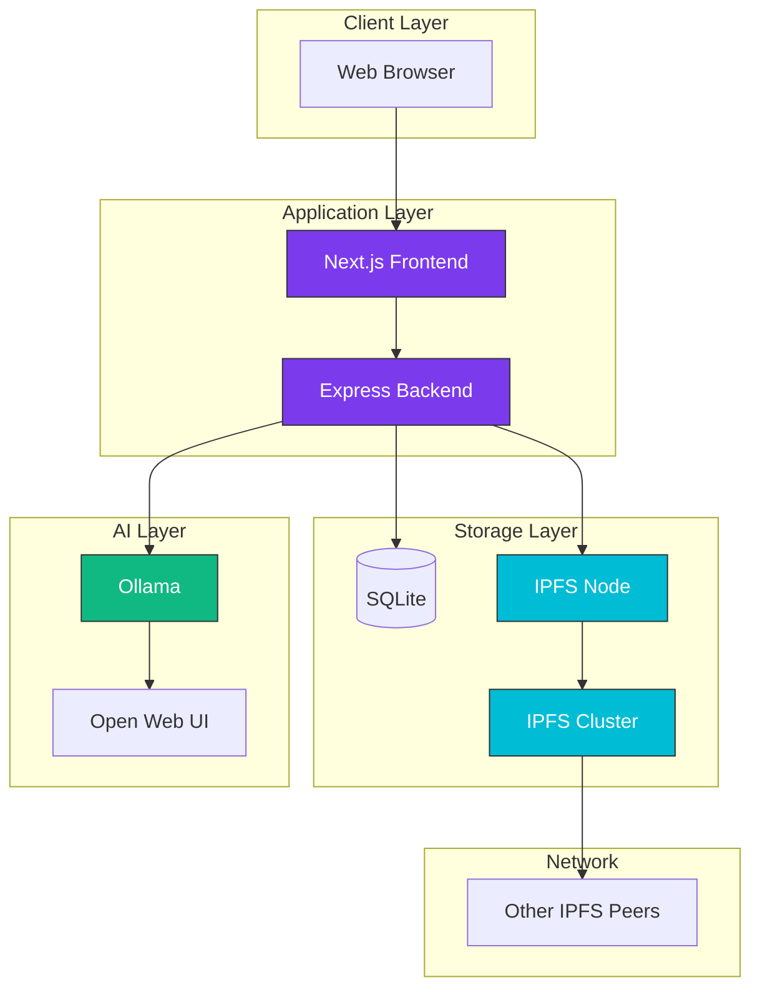

# Architecture

Understanding how TruSpace works under the hood.

-   :material-chart-box-outline:{ .lg .middle } **System Overview**

    ---

    High-level architecture and component interaction.

    [:octicons-arrow-right-24: Overview](overview.md)

-   :material-puzzle:{ .lg .middle } **Components**

    ---

    Detailed look at each TruSpace component.

    [:octicons-arrow-right-24: Components](components.md)

-   :material-database:{ .lg .middle } **Data Model**

    ---

    How data is structured and stored.

    [:octicons-arrow-right-24: Data Model](data-model.md)

-   :material-shield-lock:{ .lg .middle } **Security**

    ---

    Security architecture and measures.

    [:octicons-arrow-right-24: Security](security.md)

-   :material-lan:{ .lg .middle } **IPFS Network**

    ---

    Decentralized storage and sync.

    [:octicons-arrow-right-24: IPFS Network](ipfs-network.md)

## Architecture at a Glance

## Key Design Principles

### Decentralization

No central server controls data. Each TruSpace node is equal and can operate independently.

### Data Sovereignty

You own and control your data. It stays on infrastructure you control unless you explicitly share it.

### Privacy by Design

AI processing happens locally. Documents are encrypted. Private networks are supported.

### Simplicity

One-command installation. Minimal configuration. Works out of the box.
