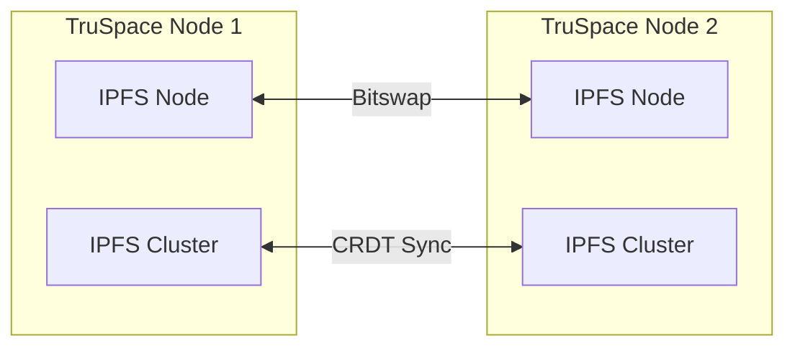

# IPFS Network

How TruSpace uses IPFS for decentralized storage.

## What is IPFS?

IPFS (InterPlanetary File System) is a peer-to-peer protocol for storing and sharing data in a distributed file system.

### Content Addressing

Instead of location-based URLs, IPFS uses **Content IDs (CIDs)** - hashes of the content itself:

```
QmXnnyufdzAWL5CqZ2RnSNgPbvCc1ALT73s6epPrRnZ1Xy
```

This means:
- Same content = same CID everywhere
- Content can be fetched from any peer
- Built-in integrity verification

## TruSpace IPFS Architecture



## IPFS Cluster

IPFS Cluster coordinates pinning across multiple nodes:

- **Automatic replication**: Content pinned on one node replicates to others
- **Consensus**: CRDT-based for availability over consistency
- **Pin management**: Track what should be stored where

## Connecting Nodes

### Automatic Connection

```bash
# Generate connection details on Node A
./scripts/fetch-connection.sh -e

# Connect from Node B
./scripts/connectPeer-automatic.sh .connection .connection.password
```

### Manual Connection

```bash
./scripts/connectPeer-manually.sh \
  <peer_ip> \
  <ipfs_peer_id> \
  <cluster_peer_id> \
  <ipfs_container> \
  <cluster_container>
```

## Private Networks

For private deployments:

1. Generate a swarm key
2. Share only with trusted peers
3. Configure IPFS to use private mode

```bash
# All nodes must have the same swarm.key
# Placed in IPFS configuration directory
```

## Data Flow

### Upload

1. Document encrypted by backend
2. Added to local IPFS node → CID generated
3. Cluster pins the content
4. Replicates to connected peers

### Retrieval

1. Request by CID
2. Local check first
3. If not found, fetch from peers
4. Decrypt and serve to user

## Configuration

Key IPFS settings in environment:

```env
IPFS_PROFILE=server        # Or 'lowpower' for Raspberry Pi
IPFS_BOOTSTRAP_REMOVE=true # For private networks
```
