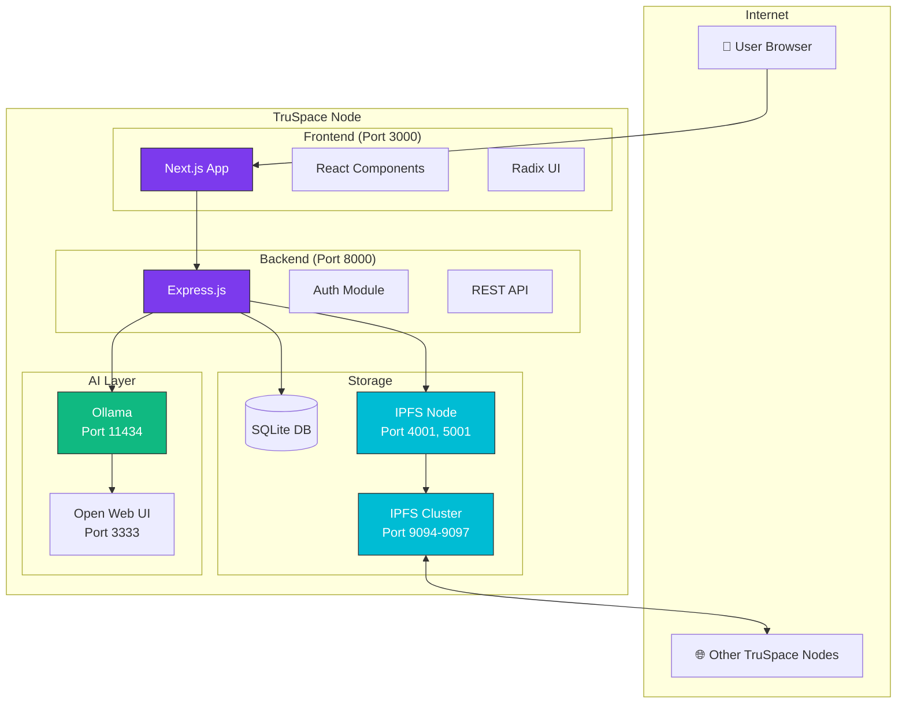
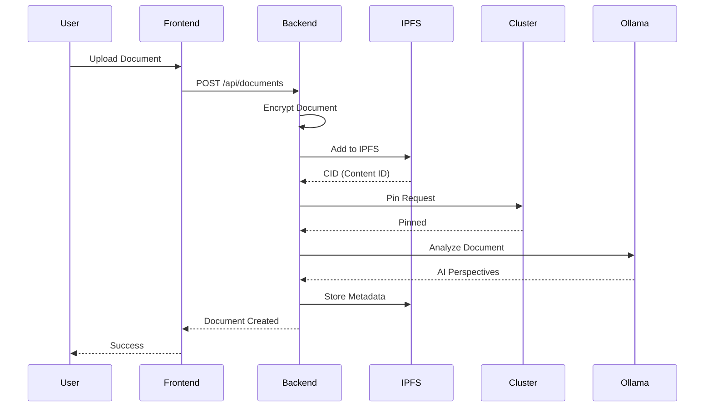
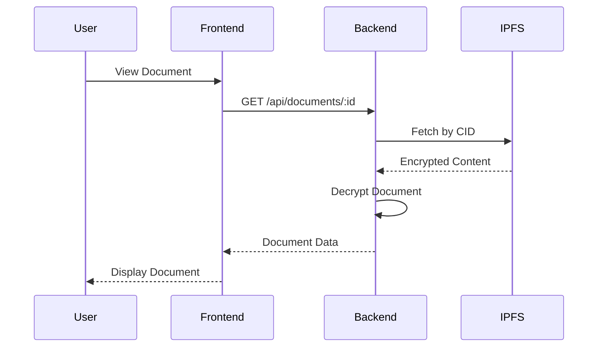

# System Overview

TruSpace is built as a distributed application with multiple cooperating services.

## Architecture Diagram



## Service Ports

| Service | Port | Protocol | Purpose |
|---------|------|----------|---------|
| Frontend | 3000 | HTTP | Web interface |
| Backend | 8000 | HTTP | REST API |
| IPFS API | 5001 | HTTP | IPFS operations |
| IPFS Gateway | 8080 | HTTP | Content gateway |
| IPFS Swarm | 4001 | TCP/UDP | Peer connections |
| Cluster API | 9094 | HTTP | Cluster management |
| Cluster Sync | 9096 | TCP | Cluster consensus |
| Open Web UI | 3333 | HTTP | AI interface |
| Ollama | 11434 | HTTP | LLM API |

## Request Flow

### Document Upload



### Document Retrieval



## Data Storage

### What Goes Where

| Data Type | Storage | Encrypted | Synced |
|-----------|---------|-----------|--------|
| User credentials | SQLite | ✓ (bcrypt) | ✗ |
| User profiles | SQLite | ✗ | ✗ |
| Documents | IPFS | ✓ | ✓ |
| Metadata | IPFS | ✗ | ✓ |
| AI perspectives | IPFS | ✗ | ✓ |
| Workspace config | IPFS | ✗ | ✓ |
| AI models | Local disk | ✗ | ✗ |

## Network Topology

### Single Node

```
┌─────────────────────────────────────┐
│            TruSpace Node            │
│  ┌─────────┐  ┌─────────┐          │
│  │Frontend │  │ Backend │          │
│  └────┬────┘  └────┬────┘          │
│       │            │                │
│  ┌────┴────────────┴────┐          │
│  │         IPFS         │          │
│  └──────────────────────┘          │
└─────────────────────────────────────┘
```

### Connected Nodes

```
┌──────────────────┐     ┌──────────────────┐
│   TruSpace A     │     │   TruSpace B     │
│  ┌────────────┐  │     │  ┌────────────┐  │
│  │    IPFS    │◄─┼─────┼─►│    IPFS    │  │
│  └────────────┘  │     │  └────────────┘  │
│  ┌────────────┐  │     │  ┌────────────┐  │
│  │  Cluster   │◄─┼─────┼─►│  Cluster   │  │
│  └────────────┘  │     │  └────────────┘  │
└──────────────────┘     └──────────────────┘
         ▲                        ▲
         │                        │
         └────────────┬───────────┘
                      │
              ┌───────┴───────┐
              │  TruSpace C   │
              │ ┌───────────┐ │
              │ │   IPFS    │ │
              │ └───────────┘ │
              └───────────────┘
```

## Scalability Considerations

### Horizontal Scaling

- Add more TruSpace nodes to the network
- IPFS handles content distribution automatically
- Cluster ensures data availability

### Vertical Scaling

- Increase resources for AI processing
- Add GPUs for faster LLM inference
- Expand storage for larger document sets

### Limitations

| Factor | Practical Limit |
|--------|-----------------|
| Nodes per network | ~50 (soft limit) |
| Documents per workspace | ~10,000 |
| Document size | 100 MB recommended |
| Concurrent users | ~100 per node |
