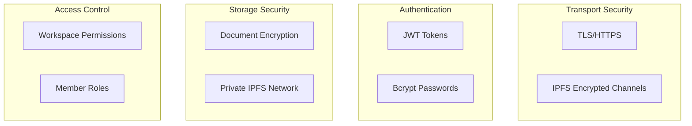

# Security

TruSpace implements multiple layers of security.

## Security Architecture



## Authentication

### Password Storage

- Passwords hashed with **bcrypt**
- Unique salt per password
- Cost factor of 12 rounds

### Session Management

- JWT tokens for API authentication
- Configurable expiration
- Secure token storage

## Encryption

### Document Encryption

Documents are encrypted before IPFS storage:

- **Algorithm**: AES-256-CBC
- **Key derivation**: Workspace ID based
- **Decryption**: Only through TruSpace API

### Network Encryption

- All IPFS peer connections are encrypted
- Support for private IPFS networks via swarm keys

## Private Network

For sensitive deployments, use private IPFS:

```bash
# Generate swarm key
ipfs-swarm-key-gen > swarm.key

# Share with trusted peers only
```

## Access Control

### Workspace Levels

| Role | View | Edit | Delete | Admin |
|------|------|------|--------|-------|
| Viewer | ✓ | ✗ | ✗ | ✗ |
| Editor | ✓ | ✓ | ✗ | ✗ |
| Admin | ✓ | ✓ | ✓ | ✓ |

## Best Practices

1. **Change default secrets** in production
2. **Use private IPFS networks** for sensitive data
3. **Enable HTTPS** via reverse proxy
4. **Regular backups** of SQLite database
5. **Keep software updated**
