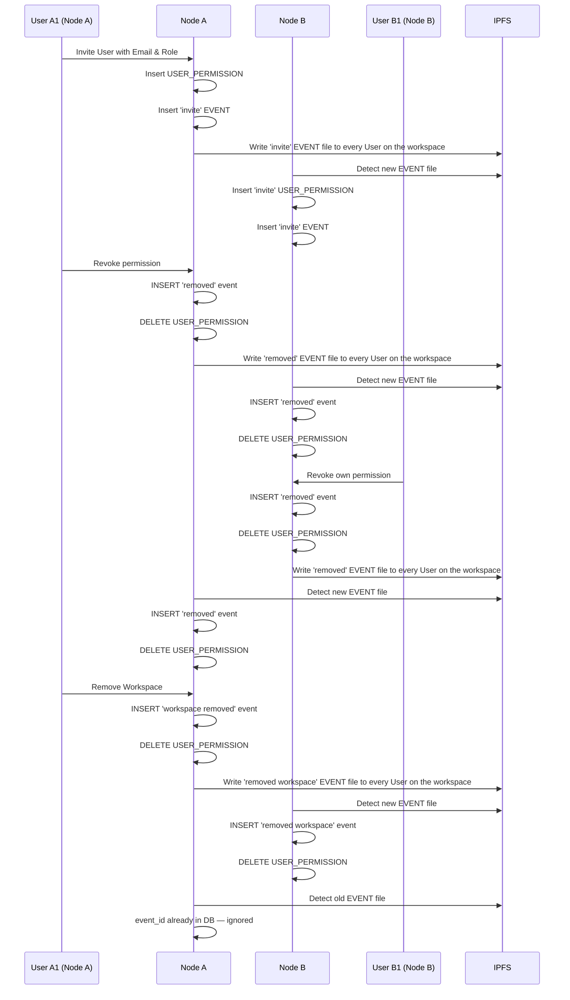
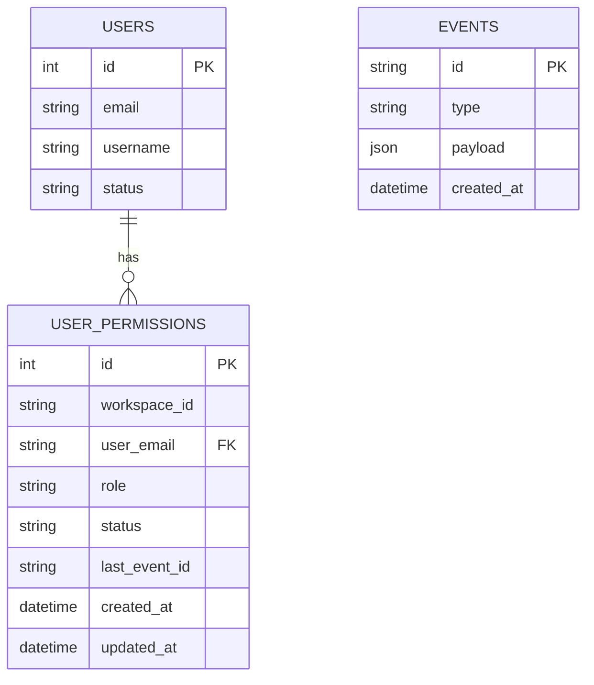

# Workflows

This page documents key operational workflows in TruSpace — how data, permissions, and events move through the system. Workflows are categorised as **established** (implemented and in production) or **proposed** (under discussion or in development).

---

## Established Workflows

### Document Upload & Encryption

1. User selects a file in the frontend
2. The backend receives the file bytes via `multipart/form-data` (held in multer memory storage)
3. The file is encrypted with **AES-256-CBC** using a PBKDF2-derived key based on the workspace ID
4. The ciphertext is added to the local IPFS node → a **CID** is generated
5. IPFS Cluster pins the CID and replicates it to connected peers
6. Document metadata (CID, filename, workspace ID, uploader) is written to IPFS as a separate small file
7. The frontend receives the CID and displays the new document version

### Document Retrieval & Decryption

1. Frontend requests a document version by CID via `GET /api/documents/version/:cid`
2. Backend fetches the ciphertext blob from IPFS (local node first, then peers)
3. Backend decrypts with AES-256-CBC using the workspace key
4. Plaintext bytes are streamed to the client
5. Frontend renders the document

!!! note "Direct IPFS access returns ciphertext"
    Because files are encrypted before IPFS storage, fetching a CID directly from the IPFS gateway returns the encrypted blob. Decryption only happens through the TruSpace API.

---

## Proposed Workflows

### #292 — Private Workspace Permissions Across IPFS Nodes

!!! info "Status: Proposed"
    This workflow is under active development. The design is finalised; implementation is in progress.

#### Problem

User management and access rights are stored **locally per node**. Inviting a user from another node only updates the local database on the inviter's node. The remote node has no record of the permission, so the invited user cannot access the workspace from their own node.

#### Proposed Solution

Introduce a **cross-node invitation system** using:

- `USER_PERMISSIONS` as a materialised view of who has access to what
- A generic `EVENTS` table as an append-only log
- **IPFS as the event bus** — event files written to IPFS are detected and processed by remote nodes
- **Email as the global user identifier** across nodes (see [ADR-002](decisions/adr-002-email-global-id.md))

#### Workflow Steps

1. User A on Node A selects a private workspace and enters the email of User B (on Node B)
2. Node A creates a `USER_PERMISSIONS` record for User B's email locally
3. Node A writes a `PERMISSION-EVENT` record to its local `EVENTS` table
4. Node A writes the event as a small file to the IPFS event bus directory
5. Node B detects the new event file on next login or manual refresh
6. Node B creates the corresponding `USER_PERMISSIONS` record locally
7. Node B marks the event as processed in its local `EVENTS` table

The same flow applies to **revocations** (by the inviter), **self-removals** (by the invitee), and **workspace deletions** — each generating a distinct event type.

Idempotency is guaranteed: if a node receives the same event twice, the `event_id` lookup prevents duplicate processing.

#### Full Lifecycle Sequence Diagram

#### Proposed Database Changes

The `USER_PERMISSIONS` table gains a `last_event_id` column. The `EVENTS` table is introduced as a new append-only log:

#### Trade-offs

| Pros | Cons / Considerations |
|---|---|
| Each node stays authoritative for its own users | Emails propagate across nodes — privacy policy must reflect this |
| Email as global ID — no central registry needed | Requires idempotent event handling |
| Offline-safe — nodes catch up via IPFS replay | UI must handle pending, active, revoked, and self-removed states |
| Extensible to notifications, expirations, role changes | Eventual consistency — no real-time guarantee |

---

## Contributing a Workflow

To add or update a workflow:

1. Create a Markdown file in `doc/Architecture/workflows/proposed/`
2. Include a Mermaid diagram (`.mmd`) in the same folder
3. Open a PR for review
4. Once accepted, move the file to `doc/Architecture/workflows/established/`
5. Add a section to this page and update `mkdocs.yml`

See the [Architecture README](https://github.com/openkfw/TruSpace/blob/main/doc/Architecture/README.md) for the full diagram generation workflow using Mermaid CLI.

---

## Related

- [:octicons-arrow-right-24: ADR-001 — IPFS as Event Bus](decisions/adr-001-ipfs-event-bus.md)
- [:octicons-arrow-right-24: ADR-002 — Email as Global Identifier](decisions/adr-002-email-global-id.md)
- [:octicons-arrow-right-24: Data Model](data-model.md)
- [:octicons-arrow-right-24: IPFS Network](ipfs-network.md)
