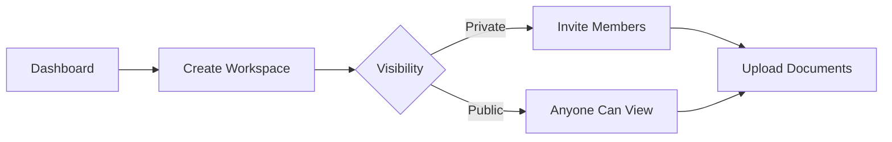

# First Steps

Now that TruSpace is running, let's walk through the essential first steps.

## :material-account-plus: Create Your Account

1. Open TruSpace at `http://localhost:3000` (or your configured domain)
2. Click **"Register"**
3. Fill in your details:
   - **Username**: Your unique identifier
   - **Email**: For notifications (stored locally)
   - **Password**: Minimum 8 characters

!!! info "Local Storage"
    Your credentials are stored securely in the local SQLite database. Nothing is sent to external servers.

## :material-login: Login

After registration:

1. Enter your username/email
2. Enter your password
3. Click **"Login"**

You'll be taken to the **Dashboard**.

## :material-folder-plus: Create Your First Workspace

Workspaces organize your documents and collaborators.

1. Click **"Create Workspace"** on the dashboard
2. Enter a **name** for your workspace
3. Choose **visibility**:
   - **Private**: Only you and invited members
   - **Public**: Visible to all users on this node



## :material-file-upload: Upload a Document

1. Open your workspace
2. Click **"Upload"** or drag & drop files
3. Supported formats:
   - PDF, Word, Excel, PowerPoint
   - Images (PNG, JPG, GIF)
   - Text files, Markdown
   - And more...

!!! tip "AI Analysis"
    If AI is enabled, documents are automatically analyzed after upload. This may take a few moments.

## :material-brain: Explore AI Features

With AI enabled, you can:

### Ask Questions About Documents

1. Open a document
2. Use the **chat interface** to ask questions
3. AI will respond based on document content

### View AI Perspectives

1. Click **"AI Perspectives"** on a document
2. See pre-generated summaries and insights
3. Customize prompts in settings

## :material-account-group: Invite Collaborators

For private workspaces:

1. Open workspace settings
2. Click **"Invite Member"**
3. Enter their username or email
4. Set their permission level:
   - **Viewer**: Read-only access
   - **Editor**: Can upload and edit
   - **Admin**: Full control

!!! note "Same Node Requirement"
    Collaborators must have an account on the same TruSpace node, or you need to connect nodes (see next section).

## :material-connection: Connect to Other Nodes

To sync with other TruSpace installations:

### Quick Connection

```bash
# On target node: Generate connection details
./scripts/fetch-connection.sh -e

# On your node: Use the connection file
./scripts/connectPeer-automatic.sh .connection .connection.password
```

Once connected:

- Workspaces are synced automatically
- Documents replicate across nodes
- AI perspectives are shared

[:octicons-arrow-right-24: Full Connection Guide](../guides/admin/connecting-nodes.md)

## :material-cog: Explore Settings

### User Settings

- Profile information
- Password change
- Notification preferences

### System Status

Check the health of your TruSpace installation:

1. Go to **Settings > System Status**
2. View:
   - IPFS node status
   - Connected peers
   - Storage usage
   - AI model status

## Common First-Time Actions

| Action | How |
|--------|-----|
| Change password | Settings > Profile > Change Password |
| Dark mode | Toggle in header |
| View storage | Settings > System Status |
| Check connected peers | Settings > IPFS Status |

## What's Next?

<div class="grid cards" markdown>

-   :material-file-document-multiple: **Organize Documents**

    Learn advanced document management.

    [:octicons-arrow-right-24: Documents Guide](../guides/user/documents.md)

-   :material-brain: **Master AI Features**

    Get the most from AI analysis.

    [:octicons-arrow-right-24: AI Features](../guides/user/ai-features.md)

-   :material-shield-lock: **Understand Security**

    Learn how your data is protected.

    [:octicons-arrow-right-24: Security](../architecture/security.md)

-   :material-cog-outline: **Configure TruSpace**

    Customize your installation.

    [:octicons-arrow-right-24: Configuration](../configuration/index.md)

</div>
