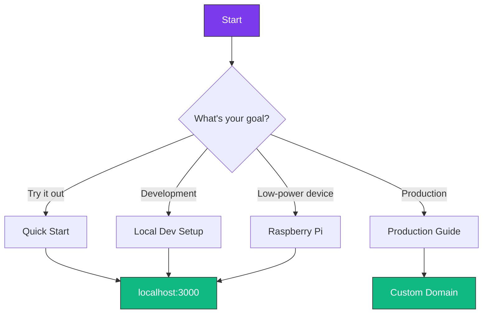

# Getting Started with TruSpace

Welcome to TruSpace! This section will help you get up and running quickly.

<div class="grid cards" markdown>

-   :material-timer-sand:{ .lg .middle } **Quick Start** *(5 minutes)*

    ---

    Get TruSpace running with a single command.

    [:octicons-arrow-right-24: Quick Start Guide](quickstart.md)

-   :material-cog:{ .lg .middle } **Installation Guides**

    ---

    Detailed setup for different environments.

    [:octicons-arrow-right-24: Installation Options](installation/index.md)

-   :material-shoe-print:{ .lg .middle } **First Steps**

    ---

    Create your first user and workspace.

    [:octicons-arrow-right-24: First Steps](first-steps.md)

-   :material-frequently-asked-questions:{ .lg .middle } **FAQ**

    ---

    Common questions and answers.

    [:octicons-arrow-right-24: FAQ](faq.md)

</div>

## Prerequisites

Before installing TruSpace, ensure you have:

| Requirement | Minimum | Recommended |
|-------------|---------|-------------|
| **Docker** | 20.10+ | Latest |
| **Docker Compose** | 2.0+ | Latest |
| **RAM** | 4 GB | 8 GB+ |
| **Storage** | 10 GB | 50 GB+ |
| **OS** | Linux, macOS, Windows (WSL) | Ubuntu 22.04 LTS |

!!! tip "Check Docker Installation"
    ```bash
    docker --version
    docker compose version
    ```

## Choose Your Path



## What Gets Installed?

TruSpace deploys the following containers:

| Container | Purpose | Port |
|-----------|---------|------|
| `truspace-frontend` | Next.js web interface | 3000 |
| `truspace-backend` | Express API server | 8000 |
| `ipfs0` | IPFS node (Kubo) | 4001, 5001, 8080 |
| `cluster0` | IPFS Cluster daemon | 9094, 9096-9097 |
| `truspace-webui` | Open Web UI (AI) | 3333 |
| `ollama` | LLM engine | 11434 |

!!! info "AI Components Optional"
    The Ollama and Open Web UI containers are optional. Use `--no-ai` flag to skip them.
