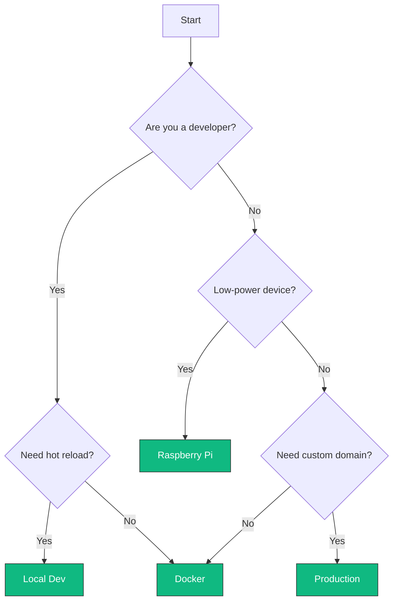

# Installation Options

TruSpace supports multiple deployment scenarios. Choose the one that fits your needs:

-   :material-laptop:{ .lg .middle } **Local Development**

    ---

    Best for: Developers, testing, evaluation
    
    - Hot reload for frontend/backend
    - Debug-friendly setup
    - Quick iteration

    [:octicons-arrow-right-24: Local Dev Setup](local-dev.md)

-   :material-docker:{ .lg .middle } **Docker Deployment**

    ---

    Best for: Quick setup, standard deployment
    
    - One-command installation
    - Consistent environment
    - Easy updates

    [:octicons-arrow-right-24: Docker Guide](docker.md)

-   :simple-raspberrypi:{ .lg .middle } **Raspberry Pi**

    ---

    Best for: Low-power, edge deployments
    
    - ARM64 compatible
    - Low resource usage
    - Always-on node

    [:octicons-arrow-right-24: Raspberry Pi Guide](raspberry-pi.md)

-   :material-server:{ .lg .middle } **Production**

    ---

    Best for: Enterprise, multi-user
    
    - Custom domains
    - SSL/TLS setup
    - High availability

    [:octicons-arrow-right-24: Production Guide](production.md)

## Comparison Matrix

| Feature | Local Dev | Docker | Raspberry Pi | Production |
|---------|-----------|--------|--------------|------------|
| Setup Time | 10 min | 5 min | 15 min | 30+ min |
| Hot Reload | :white_check_mark: | :x: | :x: | :x: |
| Resource Usage | High | Medium | Low | Medium |
| Custom Domain | :x: | Optional | Optional | :white_check_mark: |
| SSL/TLS | :x: | Optional | Optional | :white_check_mark: |
| Recommended RAM | 8 GB+ | 4 GB+ | 4 GB+ | 8 GB+ |
| AI Features | :white_check_mark: | :white_check_mark: | Limited | :white_check_mark: |

## Prerequisites

All installation methods require:

=== "Required"

    - **Docker** 20.10+
    - **Docker Compose** 2.0+
    - **Git**

=== "For AI Features"

    - Additional 4 GB RAM
    - ~4 GB storage for models
    - CPU with AVX2 support (or GPU)

=== "For Production"

    - Domain name
    - SSL certificate
    - Reverse proxy (nginx/traefik)

## Quick Decision Guide

