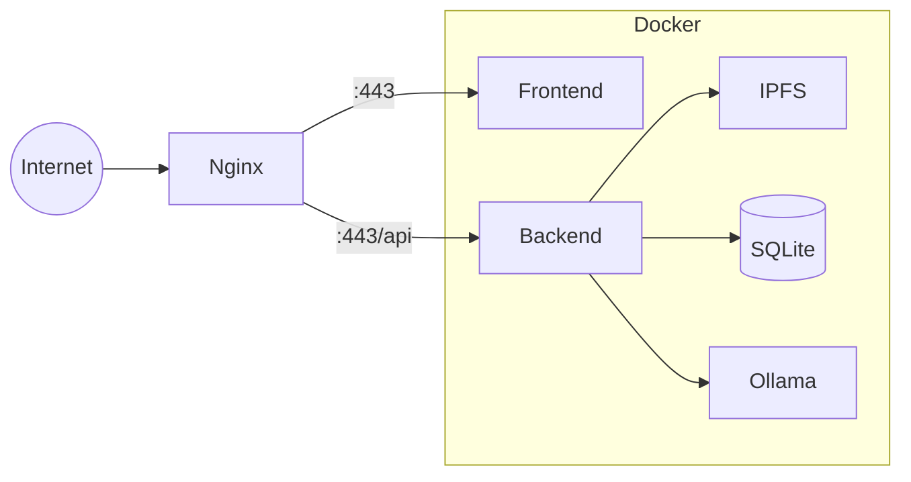

# Production Deployment

Deploy TruSpace with a custom domain, SSL/TLS, and production-ready configuration.

## Prerequisites

- Linux server (Ubuntu 22.04 LTS recommended)
- Domain name pointing to your server
- Root/sudo access
- 8 GB RAM minimum
- Docker and Docker Compose installed

## Architecture Overview



## Step 1: Server Setup

### Install Dependencies

```bash
# Update system
sudo apt update && sudo apt upgrade -y

# Install Docker
curl -fsSL https://get.docker.com | sh
sudo usermod -aG docker $USER

# Install Docker Compose
sudo apt install docker-compose-plugin -y

# Install Nginx and Certbot
sudo apt install nginx certbot python3-certbot-nginx -y
```

### Configure Firewall

```bash
sudo ufw allow 22/tcp
sudo ufw allow 80/tcp
sudo ufw allow 443/tcp
sudo ufw allow 4001/tcp  # IPFS
sudo ufw enable
```

## Step 2: Clone and Configure

```bash
# Clone TruSpace
cd /opt
sudo git clone https://github.com/openkfw/TruSpace.git
sudo chown -R $USER:$USER TruSpace
cd TruSpace
```

### Configure Environment

```bash
# Create production environment
cp .env.example .env
nano .env
```

```env title=".env"
# Domain configuration
CORS_ORIGIN=https://yourdomain.com
OI_CORS_ALLOW_ORIGIN=https://yourdomain.com

# Production settings
NODE_ENV=production
LOG_LEVEL=info

# Secure passwords (change these!)
CLUSTER_SECRET=your-secure-cluster-secret-here
JWT_SECRET=your-secure-jwt-secret-here

# AI Configuration (optional)
OLLAMA_MODEL=llama3.2:3b
DISABLE_ALL_AI_FUNCTIONALITY=false
```

!!! danger "Change Default Secrets"
    Always generate unique secrets for production:
    ```bash
    openssl rand -hex 32  # For CLUSTER_SECRET
    openssl rand -hex 64  # For JWT_SECRET
    ```

## Step 3: Configure Nginx

### Create Nginx Configuration

```bash
sudo nano /etc/nginx/sites-available/truspace
```

```nginx title="/etc/nginx/sites-available/truspace"
server {
    listen 80;
    server_name yourdomain.com;
    return 301 https://$server_name$request_uri;
}

server {
    listen 443 ssl http2;
    server_name yourdomain.com;

    # SSL configuration (will be managed by Certbot)
    ssl_certificate /etc/letsencrypt/live/yourdomain.com/fullchain.pem;
    ssl_certificate_key /etc/letsencrypt/live/yourdomain.com/privkey.pem;
    
    # Security headers
    add_header X-Frame-Options "SAMEORIGIN" always;
    add_header X-Content-Type-Options "nosniff" always;
    add_header X-XSS-Protection "1; mode=block" always;
    add_header Referrer-Policy "strict-origin-when-cross-origin" always;

    # Frontend
    location / {
        proxy_pass http://localhost:3000;
        proxy_http_version 1.1;
        proxy_set_header Upgrade $http_upgrade;
        proxy_set_header Connection 'upgrade';
        proxy_set_header Host $host;
        proxy_set_header X-Real-IP $remote_addr;
        proxy_set_header X-Forwarded-For $proxy_add_x_forwarded_for;
        proxy_set_header X-Forwarded-Proto $scheme;
        proxy_cache_bypass $http_upgrade;
    }

    # Backend API
    location /api {
        proxy_pass http://localhost:8000;
        proxy_http_version 1.1;
        proxy_set_header Host $host;
        proxy_set_header X-Real-IP $remote_addr;
        proxy_set_header X-Forwarded-For $proxy_add_x_forwarded_for;
        proxy_set_header X-Forwarded-Proto $scheme;
        
        # File upload limits
        client_max_body_size 100M;
    }

    # WebSocket support
    location /ws {
        proxy_pass http://localhost:8000;
        proxy_http_version 1.1;
        proxy_set_header Upgrade $http_upgrade;
        proxy_set_header Connection "upgrade";
        proxy_set_header Host $host;
    }
}
```

### Enable Site

```bash
sudo ln -s /etc/nginx/sites-available/truspace /etc/nginx/sites-enabled/
sudo nginx -t
sudo systemctl restart nginx
```

## Step 4: SSL Certificate

### Using Let's Encrypt

```bash
# Get certificate
sudo certbot --nginx -d yourdomain.com

# Verify auto-renewal
sudo certbot renew --dry-run
```

## Step 5: Start TruSpace

```bash
cd /opt/TruSpace
./start.sh
```

### Verify Deployment

```bash
# Check containers
docker ps

# Check Nginx
sudo nginx -t
sudo systemctl status nginx

# Test endpoints
curl -I https://yourdomain.com
curl https://yourdomain.com/api/health
```

## Step 6: Systemd Service

Create a systemd service for automatic startup:

```bash
sudo nano /etc/systemd/system/truspace.service
```

```ini title="/etc/systemd/system/truspace.service"
[Unit]
Description=TruSpace Application
Requires=docker.service
After=docker.service

[Service]
Type=oneshot
RemainAfterExit=yes
WorkingDirectory=/opt/TruSpace
ExecStart=/usr/bin/docker compose up -d
ExecStop=/usr/bin/docker compose down
TimeoutStartSec=0

[Install]
WantedBy=multi-user.target
```

```bash
sudo systemctl daemon-reload
sudo systemctl enable truspace
```

## Security Hardening

### Restrict Docker API

```bash
# Ensure Docker daemon is not exposed
sudo nano /etc/docker/daemon.json
```

```json
{
  "hosts": ["unix:///var/run/docker.sock"],
  "log-driver": "json-file",
  "log-opts": {
    "max-size": "10m",
    "max-file": "3"
  }
}
```

### Regular Updates

```bash
# Create update script
cat > /opt/TruSpace/update.sh << 'EOF'
#!/bin/bash
cd /opt/TruSpace
git pull origin main
docker compose down
docker compose pull
docker compose up -d
EOF

chmod +x /opt/TruSpace/update.sh
```

## Monitoring

### Basic Health Check

```bash
# Add to crontab
crontab -e
```

```cron
*/5 * * * * curl -sf https://yourdomain.com/api/health || systemctl restart truspace
```

### Log Rotation

```bash
sudo nano /etc/logrotate.d/truspace
```

```
/opt/TruSpace/logs/*.log {
    daily
    rotate 7
    compress
    delaycompress
    missingok
    notifempty
}
```

## Backup Strategy

### Automated Backups

```bash
cat > /opt/TruSpace/backup.sh << 'EOF'
#!/bin/bash
BACKUP_DIR=/backups/truspace
DATE=$(date +%Y%m%d)

mkdir -p $BACKUP_DIR

# Backup SQLite
docker run --rm -v truspace_sqlite_data:/data -v $BACKUP_DIR:/backup \
  alpine tar czf /backup/sqlite-$DATE.tar.gz -C /data .

# Backup IPFS (optional, can be large)
# docker run --rm -v truspace_ipfs_data:/data -v $BACKUP_DIR:/backup \
#   alpine tar czf /backup/ipfs-$DATE.tar.gz -C /data .

# Keep last 7 days
find $BACKUP_DIR -mtime +7 -delete
EOF

chmod +x /opt/TruSpace/backup.sh

# Add to crontab for daily backups at 2 AM
echo "0 2 * * * /opt/TruSpace/backup.sh" | crontab -
```

## Troubleshooting

### SSL Issues

```bash
# Check certificate
sudo certbot certificates

# Renew manually
sudo certbot renew --force-renewal
```

### Performance Issues

```bash
# Check resource usage
docker stats

# Check nginx errors
tail -f /var/log/nginx/error.log
```

## Next Steps

- [:octicons-arrow-right-24: Connecting Nodes](../../guides/admin/connecting-nodes.md)
- [:octicons-arrow-right-24: Backup & Recovery](../../guides/admin/backup-recovery.md)
- [:octicons-arrow-right-24: Security Details](../../architecture/security.md)
