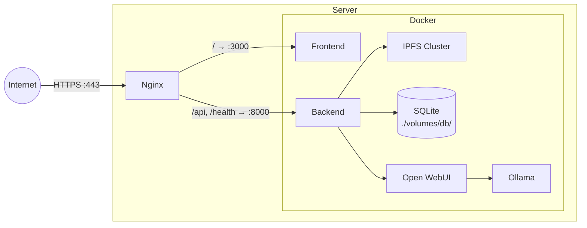

# Production Deployment

Deploy TruSpace with a custom domain, SSL/TLS, and production-ready configuration using nginx as a reverse proxy.

## Prerequisites

- Linux server (Ubuntu 22.04 LTS recommended)
- Domain name with DNS A-records pointing to your server
- Root/sudo access
- 8 GB RAM minimum (16 GB recommended with AI features)
- Docker and Docker Compose installed

## Architecture Overview


```mermaid
flowchart LR
    Internet((Internet)) -->|HTTPS :443| Nginx

    subgraph Server
        Nginx -->|/ → :3000| Frontend
        Nginx -->|/api, /health → :8000| Backend

        subgraph Docker
            Frontend
            Backend --> IPFS[IPFS Cluster]
            Backend --> DB[(SQLite\n./volumes/db/)]
            Backend --> WebUI[Open WebUI]
            WebUI --> Ollama
        end
    end
```

nginx terminates SSL and routes requests: the root path goes to the frontend container, and the `/api` and `/health` paths go to the backend. All containers run in Docker with data stored in the `./volumes/` directory on the host.

## Step 1: Server Setup

### Install Dependencies

```bash
sudo apt update && sudo apt upgrade -y

# Docker
curl -fsSL https://get.docker.com | sh
sudo usermod -aG docker $USER
newgrp docker

# nginx and Certbot
sudo apt install -y nginx certbot python3-certbot-nginx
```

### Configure Firewall

```bash
sudo ufw allow 22/tcp    # SSH
sudo ufw allow 80/tcp    # HTTP (needed for Certbot certificate issuance)
sudo ufw allow 443/tcp   # HTTPS
sudo ufw allow 4001/tcp  # IPFS swarm (peer-to-peer)
sudo ufw allow 9096/tcp  # IPFS Cluster swarm (multi-node setups)
sudo ufw enable
```

## Step 2: Clone and Configure TruSpace

```bash
# Clone (HTTPS)
git clone https://github.com/openkfw/TruSpace.git /opt/TruSpace
sudo chown -R $USER:$USER /opt/TruSpace
cd /opt/TruSpace
```

### Run the Configuration Wizard

```bash
./start.sh --configure-env
```

When prompted, select profile **`3) production`**. The wizard will pre-configure security settings appropriate for production and prompt you for:

- **Domain** — your public domain (e.g. `truspace.example.com`)
- **Master password** — must be changed from the default
- **SMTP settings** — for registration and password-reset emails
- **Open WebUI admin credentials** — for the AI management interface

Secrets (JWT, WebUI session key) are auto-generated. Everything else can be confirmed with ENTER.

!!! tip "What the production profile configures automatically"

    - `NODE_ENV=production`, `LOG_LEVEL=INFO`
    - `USE_REVERSE_PROXY=true` — URLs without port numbers (`https://yourdomain.com` and `https://yourdomain.com/api`)
    - `REGISTER_USERS_AS_INACTIVE=true` — new accounts need admin activation
    - `RATE_LIMIT_PER_MINUTE=60`
    - `START_PRIVATE_NETWORK=true` — IPFS does not connect to the public network
    - `BUILD_OR_PULL_IMAGES=pull` — uses published container images

## Step 3: Configure nginx

### Initial HTTP Configuration (Pre-SSL)

Create the site file (replace `yourdomain.com` throughout):

```bash
sudo nano /etc/nginx/sites-available/truspace
```

Start with an HTTP-only config so Certbot can verify domain ownership:

```nginx title="/etc/nginx/sites-available/truspace"
server {
    listen 80;
    server_name yourdomain.com;

    # Frontend
    location / {
        proxy_pass http://localhost:3000;
        proxy_set_header Host              $host;
        proxy_set_header X-Forwarded-Host  $host;
        proxy_set_header X-Forwarded-Proto $scheme;
        proxy_set_header X-Real-IP         $remote_addr;
        proxy_set_header X-Forwarded-For   $proxy_add_x_forwarded_for;
    }

    # Backend API
    location /api {
        proxy_pass http://localhost:8000;
        proxy_set_header Host              $host;
        proxy_set_header X-Forwarded-Host  $host;
        proxy_set_header X-Forwarded-Proto $scheme;
        proxy_set_header X-Real-IP         $remote_addr;
        proxy_set_header X-Forwarded-For   $proxy_add_x_forwarded_for;
        client_max_body_size 100M;
    }

    # Health check endpoint (served by the backend)
    location /health {
        proxy_pass http://localhost:8000;
        proxy_set_header Host $host;
    }
}
```

Enable and test:

```bash
sudo ln -s /etc/nginx/sites-available/truspace /etc/nginx/sites-enabled/
sudo nginx -t && sudo systemctl reload nginx
```

## Step 4: Obtain SSL Certificate

```bash
sudo certbot --nginx -d yourdomain.com

# Verify automatic renewal works
sudo certbot renew --dry-run
```

Certbot updates your nginx config in-place. After it runs, open the config and add the security headers and WebSocket support that Certbot's automatic edit omits:

```bash
sudo nano /etc/nginx/sites-available/truspace
```

The final HTTPS server block should look like this:

```nginx title="/etc/nginx/sites-available/truspace"
server {
    listen 443 ssl;
    server_name yourdomain.com;

    # Managed by Certbot
    ssl_certificate     /etc/letsencrypt/live/yourdomain.com/fullchain.pem;
    ssl_certificate_key /etc/letsencrypt/live/yourdomain.com/privkey.pem;
    include             /etc/letsencrypt/options-ssl-nginx.conf;
    ssl_dhparam         /etc/letsencrypt/ssl-dhparams.pem;

    # Security headers
    add_header Strict-Transport-Security "max-age=31536000; includeSubDomains" always;
    add_header X-Frame-Options           "SAMEORIGIN"                          always;
    add_header X-Content-Type-Options    "nosniff"                             always;
    add_header Referrer-Policy           "strict-origin-when-cross-origin"     always;

    # Frontend (Next.js)
    location / {
        proxy_pass         http://localhost:3000;
        proxy_http_version 1.1;
        proxy_set_header   Upgrade           $http_upgrade;
        proxy_set_header   Connection        'upgrade';
        proxy_set_header   Host              $host;
        proxy_set_header   X-Forwarded-Host  $host;
        proxy_set_header   X-Forwarded-Proto $scheme;
        proxy_set_header   X-Real-IP         $remote_addr;
        proxy_set_header   X-Forwarded-For   $proxy_add_x_forwarded_for;
        proxy_cache_bypass $http_upgrade;
    }

    # Backend API (/api/* routes are handled by the backend)
    location /api {
        proxy_pass       http://localhost:8000;
        proxy_set_header Host              $host;
        proxy_set_header X-Forwarded-Host  $host;
        proxy_set_header X-Forwarded-Proto $scheme;
        proxy_set_header X-Real-IP         $remote_addr;
        proxy_set_header X-Forwarded-For   $proxy_add_x_forwarded_for;
        client_max_body_size 100M;
    }

    # Health check endpoint (backend, not the frontend)
    location /health {
        proxy_pass       http://localhost:8000;
        proxy_set_header Host $host;
    }
}

# HTTP → HTTPS redirect (managed by Certbot)
server {
    listen 80;
    server_name yourdomain.com;
    if ($host = yourdomain.com) {
        return 301 https://$host$request_uri;
    }
    return 404;
}
```

```bash
sudo nginx -t && sudo systemctl reload nginx
```

!!! note "Exposing Open WebUI publicly (optional)"
Open WebUI (the AI admin interface) runs internally on port 3333 and is not exposed in the config above. If you want to make it publicly accessible, add a second subdomain (`oi.yourdomain.com`) to your DNS and Certbot, and add a separate server block routing it to `localhost:3333`. See the [standalone server guide](../../installStandaloneServer.md) for an example.

## Step 5: Start TruSpace

```bash
cd /opt/TruSpace

# --remove-peers prevents connecting to unknown public IPFS bootstrap nodes
./start.sh --remove-peers
```

### Verify the Deployment

```bash
# Check all containers are running
docker ps

# Test the public endpoints
curl -I https://yourdomain.com              # Frontend → 200
curl https://yourdomain.com/health          # Health → JSON status
curl -I https://yourdomain.com/api/docs     # API docs → 200 or 404 (not 502)

# Check nginx
sudo nginx -t
sudo systemctl status nginx
```

## Step 6: Auto-Start on Boot

```bash
sudo nano /etc/systemd/system/truspace.service
```

```ini title="/etc/systemd/system/truspace.service"
[Unit]
Description=TruSpace Application
Requires=docker.service
After=docker.service

[Service]
Type=oneshot
RemainAfterExit=yes
WorkingDirectory=/opt/TruSpace
ExecStart=/usr/bin/docker compose up -d
ExecStop=/usr/bin/docker compose down
TimeoutStartSec=0

[Install]
WantedBy=multi-user.target
```

```bash
sudo systemctl daemon-reload
sudo systemctl enable truspace
```

## Backup Strategy

TruSpace stores all persistent data in `./volumes/` and configuration in `.env`. Back these up regularly.

```bash
cat > /opt/TruSpace/backup.sh << 'EOF'
#!/bin/bash
set -euo pipefail

BACKUP_DIR=/backups/truspace
DATE=$(date +%Y%m%d-%H%M)

mkdir -p "$BACKUP_DIR"

# Stop containers to ensure a consistent snapshot
cd /opt/TruSpace
docker compose down

# Archive data and configuration
tar czf "$BACKUP_DIR/truspace-$DATE.tar.gz" ./volumes .env

# Restart
docker compose up -d

# Prune backups older than 7 days
find "$BACKUP_DIR" -name "truspace-*.tar.gz" -mtime +7 -delete

echo "Backup complete: $BACKUP_DIR/truspace-$DATE.tar.gz"
EOF

chmod +x /opt/TruSpace/backup.sh

# Schedule daily backups at 2 AM
echo "0 2 * * * /opt/TruSpace/backup.sh >> /var/log/truspace-backup.log 2>&1" | crontab -
```

To restore from a backup:

```bash
cd /opt/TruSpace
docker compose down
rm -rf ./volumes
tar xzf /backups/truspace/truspace-<date>.tar.gz
sudo chown -R 1000:1000 ./volumes
docker compose up -d
```

## Monitoring

### Health Check Cron

```bash
crontab -e
```

```cron
*/5 * * * * curl -sf https://yourdomain.com/health > /dev/null || systemctl restart truspace
```

### Log Rotation

Docker's log rotation is configured in `/etc/docker/daemon.json`:

```bash
sudo nano /etc/docker/daemon.json
```

```json
{
  "log-driver": "json-file",
  "log-opts": {
    "max-size": "10m",
    "max-file": "3"
  }
}
```

```bash
sudo systemctl restart docker
```

## Updating TruSpace

```bash
cd /opt/TruSpace

git pull origin main
docker compose down
docker compose pull      # fetches updated images (production uses pull mode)
./start.sh --remove-peers
```

!!! warning "Check release notes before updating"
Some updates include database schema changes that require deleting `./volumes/db/truspace.db` before restarting. Documents stored in IPFS are not affected by a database reset.

## Troubleshooting

### 502 Bad Gateway from nginx

The backend or frontend container isn't running or hasn't finished starting yet.

```bash
docker ps                          # check container status
docker compose logs backend        # look for startup errors
docker compose logs frontend
```

### SSL certificate errors

```bash
# Check certificate status and expiry
sudo certbot certificates

# Force renewal
sudo certbot renew --force-renewal
sudo systemctl reload nginx
```

### Performance issues

```bash
# Container resource usage
docker stats

# nginx error log
sudo tail -f /var/log/nginx/error.log
```

### File uploads failing

If uploads larger than a few MB are rejected, check that `client_max_body_size 100M` is present in the `/api` nginx location block and that the backend `RATE_LIMIT_PER_MINUTE` is not too low for your workload.

## Next Steps

- [:octicons-arrow-right-24: Connecting Nodes](../../guides/admin/connecting-nodes.md)
- [:octicons-arrow-right-24: Backup & Recovery](../../guides/admin/backup-recovery.md)
- [:octicons-arrow-right-24: Security Details](../../architecture/security.md)
