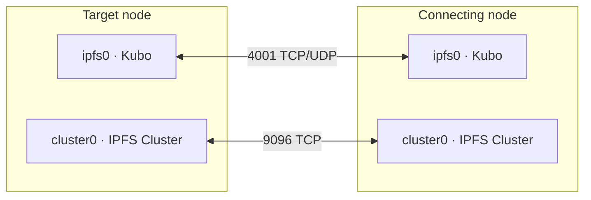

# Connecting Nodes

Connect multiple TruSpace installations to form a private, decentralized sync cluster.

## Network Topology

Each TruSpace node runs two containers that must be able to reach the corresponding containers on every other node:



## Firewall Requirements

Both ports must be open **inbound** on **every node** in the cluster. Connections are initiated from either side, so there are no asymmetric rules — the same configuration applies everywhere.

| Port | Protocol  | Service           | Purpose                                                               |
| ---- | --------- | ----------------- | --------------------------------------------------------------------- |
| 4001 | TCP + UDP | IPFS swarm (Kubo) | Block exchange between `ipfs0` containers                             |
| 9096 | TCP       | IPFS Cluster      | Peer coordination and CRDT pin-set sync between `cluster0` containers |

No other ports need to be publicly reachable. The IPFS API (5001), gateway (8080/8181), and cluster REST API (9094) should remain local-only.

---

## Automatic Connection

This is the recommended method. It packages all required credentials into an encrypted bundle.

### Step 1 — Generate connection files on the target node

On the node you want others to connect **to**, run:

```bash
./scripts/fetch-connection.sh -e
```

This creates two files in the current directory:

- `.connection` — an AES-256 encrypted bundle containing the node's IP address, IPFS peer ID, cluster peer ID, cluster secret, and swarm key.
- `.connection.password` — the plaintext decryption password for the bundle above.

!!! warning "Keep these files separate during transfer"
`.connection` is encrypted and safe to share over any channel. `.connection.password` is plaintext — treat it like a password. Ideally, deliver the two files via different channels so that intercepting one is not enough to compromise the other.

### Step 2 — Transfer the files to the connecting node

You need to get both files onto the machine running the connecting TruSpace instance. A few ways to do this:

**Secure copy (SCP)** — if you have SSH access between the nodes, this is the fastest option:

```bash
scp .connection .connection.password user@<connecting-node-ip>:/path/to/truspace/
```

For extra security, send the password file separately:

```bash
scp .connection user@<connecting-node-ip>:/path/to/truspace/
# then via a separate session or channel:
scp .connection.password user@<connecting-node-ip>:/path/to/truspace/
```

**Email** — attach `.connection` to an email and send the password in a separate message (or via a messaging app, phone call, etc.).

**Shared storage** — drop both files into a shared folder — a USB drive, your Nextcloud instance, or encrypted cloud storage — that both administrators can access.

**Copy-paste** — open each file in a text editor, copy the contents, and create a matching file on the connecting node with the same name. Both files are plain text.

### Step 3 — Run the setup script on the connecting node

Once both files are in place, connect using:

```bash
./scripts/connectPeer-automatic.sh .connection .connection.password
```

---

## Manual Connection

Use this when you want more control, or when the automatic method is not available.

```bash
./scripts/connectPeer-manually.sh \
  <peer_ip> \
  <ipfs_peer_id> \
  <cluster_peer_id> \
  <ipfs_container_id> \
  <cluster_container_id> \
  [swarm_key_path] \
  [cluster_secret_path]
```

### Getting the required IDs

```bash
# IPFS peer ID
docker exec ipfs0 ipfs id -f "<id>"

# Cluster peer ID and details
docker exec cluster0 ipfs-cluster-ctl id
```

---

## Verifying the Connection

### IPFS peers

```bash
docker exec ipfs0 ipfs swarm peers
```

The output should include the new node's multiaddress. An empty list means the IPFS swarm connection has not been established.

### Cluster peers

```bash
docker exec cluster0 ipfs-cluster-ctl peers ls
```

Both nodes should appear. A missing peer usually indicates a cluster secret mismatch or port 9096 being blocked by a firewall.

---

## Private Network Setup

When bootstrapping a new private network from scratch:

1. Generate a swarm key on the first node.
2. Distribute the swarm key to every node that should join the network.
3. Remove all public bootstrap peers from the IPFS configuration.
4. Connect peers using either method above.

---

## Troubleshooting

### Connection refused

- Confirm port **4001 TCP + UDP** is open inbound on the target node.
- Verify the IP address is correct and the node is online.
- Check that the `ipfs0` container is running: `docker ps | grep ipfs0`

### Cluster not syncing

- Confirm the cluster secret is **identical** on all nodes.
- Confirm port **9096 TCP** is open inbound on all nodes.
- Review cluster logs: `docker logs cluster0`
- Restart the cluster service if the logs show a stale or dropped connection.
