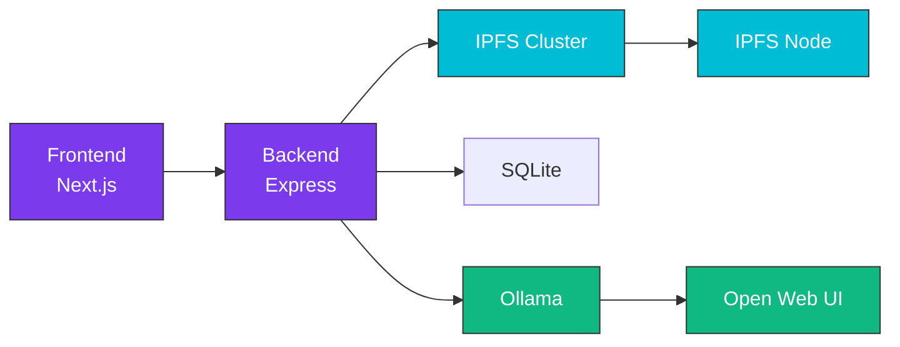

<style>
.md-content__button {
  display: none;
}
</style>

<div class="hero" markdown>

# :material-cube-outline: TruSpace

## AI-infused, Decentralized & Sovereign Document Workspace

**TruSpace** makes collaboration on documents between stakeholders more efficient while making data **sovereign to all** participants. It uses AI for document interpretation and decentralization to stay in control of your data.

[Get Started :material-rocket-launch:](getting-started/quickstart.md){ .md-button .md-button--primary }
[Try Demo :material-flask:](https://truspace.dev){ .md-button }
[View on GitHub :fontawesome-brands-github:](https://github.com/openkfw/TruSpace){ .md-button }

</div>

---

<div class="grid cards" markdown>

-   :material-open-source-initiative:{ .lg .middle } **100% Open Source**

    ---

    Fully open-source under GPL-3.0. Self-hostable with no cloud provider needed. Your data, your rules.

    [:octicons-arrow-right-24: View License](https://github.com/openkfw/TruSpace/blob/main/LICENSE)

-   :material-sync:{ .lg .middle } **Decentralized Storage**

    ---

    Built on IPFS for automatic sync between trusted nodes. Fault-tolerant and censorship-resistant architecture.

    [:octicons-arrow-right-24: Learn about IPFS](architecture/ipfs-network.md)

-   :material-brain:{ .lg .middle } **Local AI Processing**

    ---

    Powered by Ollama + Open Web UI for private, local AI document interpretation with customizable prompts.

    [:octicons-arrow-right-24: Configure AI](configuration/ai-config.md)

-   :material-folder-network:{ .lg .middle } **Workspace Organization**

    ---

    Organize content and participants in workspaces. Public and private options with granular permissions.

    [:octicons-arrow-right-24: Manage Workspaces](guides/user/workspaces.md)

-   :material-shield-lock:{ .lg .middle } **Security First**

    ---

    End-to-end encryption, private IPFS networks, and encrypted credentials. Documents synced only to trusted peers.

    [:octicons-arrow-right-24: Security Details](architecture/security.md)

-   :material-docker:{ .lg .middle } **Easy Deployment**

    ---

    One-command setup with Docker. Ready for local development, standalone servers, or Raspberry Pi.

    [:octicons-arrow-right-24: Quick Start](getting-started/quickstart.md)

</div>

---

## :rocket: Quick Start

Get TruSpace running in under 5 minutes:

=== "Linux / macOS"

    ```bash
    git clone git@github.com:openkfw/TruSpace.git
    cd TruSpace
    ./start.sh
    ```

=== "Windows (WSL)"

    ```bash
    # In WSL terminal
    git clone git@github.com:openkfw/TruSpace.git
    cd TruSpace
    ./start.sh
    ```

=== "Docker Only"

    ```bash
    git clone git@github.com:openkfw/TruSpace.git
    cd TruSpace
    docker compose up -d
    ```

Then open [http://localhost:3000](http://localhost:3000) and register your first user! :tada:

!!! tip "Try the Sandbox"
    Want to test without installing? Try our [online sandbox](https://truspace.dev) - register a user and start exploring!

---

## :building_construction: Tech Stack

<div class="grid" markdown>

| Layer | Technologies |
|-------|--------------|
| **Frontend** | TypeScript, React, Next.js, Radix UI |
| **Backend** | TypeScript, Express.js |
| **Storage** | IPFS, IPFS Cluster |
| **Database** | SQLite |
| **AI Engine** | Ollama, Open Web UI |
| **Container** | Docker |



</div>

---

## :handshake: Connect Your Nodes

Already have TruSpace running? Connect to other nodes for decentralized sync:

```bash
# On target node - generate connection details
./scripts/fetch-connection.sh -e

# On your node - connect using the received files
./scripts/connectPeer-automatic.sh .connection .connection.password
```

[:octicons-arrow-right-24: Full Connection Guide](guides/admin/connecting-nodes.md)

---

## :books: Documentation Sections

<div class="grid cards" markdown>

-   :material-rocket-launch-outline: **Getting Started**
    
    Installation guides for various environments, first steps, and FAQ.
    
    [:octicons-arrow-right-24: Start Here](getting-started/index.md)

-   :material-cog-outline: **Configuration**
    
    Environment variables, startup options, network and AI configuration.
    
    [:octicons-arrow-right-24: Configure](configuration/index.md)

-   :material-book-open-outline: **User Guide**
    
    Working with workspaces, documents, and AI features.
    
    [:octicons-arrow-right-24: User Guide](guides/user/index.md)

-   :material-tools: **Admin Guide**
    
    User management, node connections, backup and recovery.
    
    [:octicons-arrow-right-24: Admin Guide](guides/admin/index.md)

-   :material-code-braces: **Developer Guide**
    
    Development setup, contributing guidelines, API reference.
    
    [:octicons-arrow-right-24: Developer Guide](guides/developer/index.md)

-   :material-help-circle-outline: **Reference**
    
    API docs, data types, CLI reference, troubleshooting.
    
    [:octicons-arrow-right-24: Reference](reference/index.md)

</div>

---

## :speech_balloon: Community & Support

<div class="grid cards" markdown>

-   :fontawesome-brands-github: **GitHub Discussions**

    Questions, ideas, and community support.

    [:octicons-arrow-right-24: Join Discussion](https://github.com/openkfw/TruSpace/discussions)

-   :material-bug: **Issue Tracker**

    Report bugs and request features.

    [:octicons-arrow-right-24: Report Issue](https://github.com/openkfw/TruSpace/issues)

-   :fontawesome-brands-youtube: **Demo Video**

    Watch TruSpace in action.

    [:octicons-arrow-right-24: Watch Video](https://www.youtube.com/watch?v=dpo_D3NJpqE)

-   :fontawesome-brands-medium: **Blog Post**

    The story behind TruSpace.

    [:octicons-arrow-right-24: Read Story](https://medium.com/@angryarchitect/your-place-or-my-place-a-tale-of-decentralization-and-sovereignty-c775dafbadbb)

</div>
